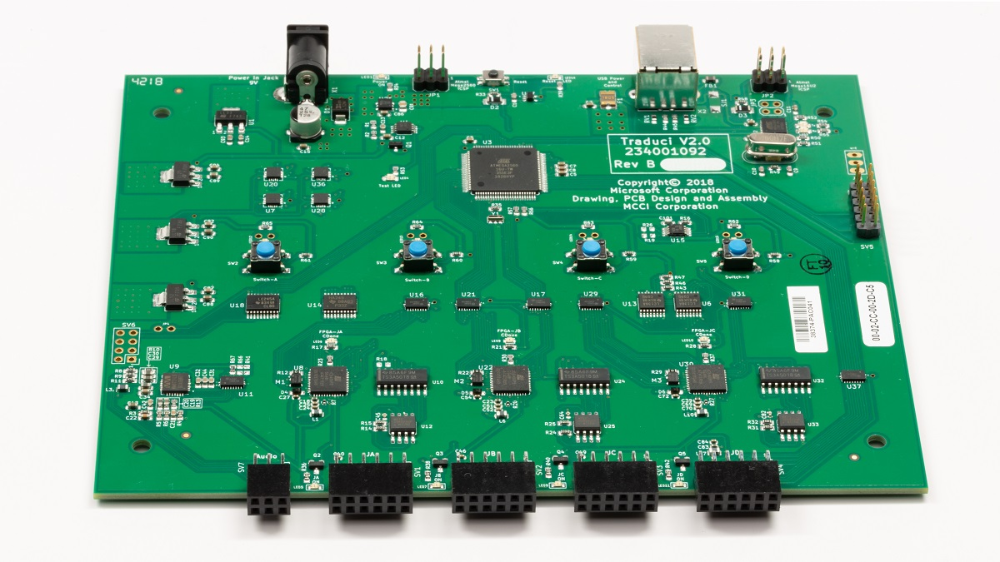

# Bluetooth Test Platform (BTP)

The **B**luetooth **T**est **P**latform (BTP) is designed for automating testing of bluetooth hardware, drivers and software. BTP can be used to exercise bluetooth radios in the host (inside the PC) and peripheral radios. 

The Bluetooth Test Platform (BTP) is the software component of Microsoft's latest automated Bluetooth testing. The Traduci is the hardware platform that the BTP runs on and supports peripheral radios to be plugged into it. The package consists of software tests, a firmware package, a provisioning tool  the Traduci board and a set of peripheral radios used for testing basic functionality.

As this time the only supported radio is the RN42. Purchasing information for the Traduci, RN42 and future radios can be found below.

### Devices ###

Traduci board
[**MCCI**](https://mcci.com/usb/dev-tools/model-2411/)

RN42 Radio Sled
[**Digilent**](https://store.digilentinc.com/pmod-bt2-bluetooth-interface/)

### Setting up Traduci Hardware ###

Using the supplied USB A-to-B cable plug the Traduci into a USB port on the system under test (SUT). Performance is best if the USB A port on the PC is directly powered & not on an internal hub. Orient the Traduci so that LEDs and buttons are face up. Next orient the RN42 radio sled such that the printed label on the radio containing the MAC address is face up. Keeping this orientation, plug the RN42 radio in the 12 Pin port labeled JB.

### Capturing Logs ###

To capture the Bluetooth logs, follow the instructions at https://aka.ms/BluetoothTracing.

### Support ###

Questions and comments about the tests should be sent to BTPSupport@microsoft.com.

#### Known issues ####

- Power: If the device is plugged into a non-powered hub or VCC is not able to supply 5V intermittent failures may be seen. Please remedy by using a powered USB hub or use a 9V AC-DC Barrel adapter.

- Stress tests: If the test is run in a tight loop there an issue where the radios will not have finished disconnecting after the pairing test reports success before the next test attempts to pair resulting in a failure.