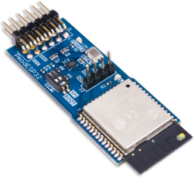

# Wi-Fi Capable Peripheral Radios

The Bluetooth Test Platform (BTP) Traduci board requires a 12-pin connector to communicate with any radio module. The Wi-Fi radios and breakouts listed here take a radio module and break out the necessary pins to the required 12-pin layout.

| Radio | Capabilities | Parameter |
| --- | --- | --- |
| ESP32 | Wi-Fi soft AP and server | esp32wifi (ex. RunWiFiCoexScenarioTests.bat rn52 esp32wifi) |

## Wi-Fi Sled (ESP32 radio)

The ESP32 is a microcontorller with integrated Wi-Fi and dual-mode Bluetooth designed for use in IOT devices.
More information can be found via the ESP32 page from [**Espressif**](https://www.espressif.com/en/products/socs/esp32).
The Model 2433 ESP32 allows the ESP32 to be utilized as a Traduci sled device.
More information can be found via the Model 2433 ESP32 page from [**MCCI**](https://store.mcci.com/products/esp32-sled) or [**Digilent**](https://store.digilentinc.com/pmod-esp32-wireless-communication-module).

### ESP32 Radio

### ESP32 Radio on BTP-compatible sled

> [!NOTE]
> The ESP32 radio can **only** be plugged into the Traduci board 12-pin port labeled 'JD'.

### Features

- Wi-Fi, Bluetooth LE, and Bluetooth communication available
- 20.5 dBm output power at the antenna
- Custom firmware to enable updates delivered through the Traduci
- 12-pin Pmod connector with SPI and UART interfaces
- Supports creation of Wi-Fi soft access points
- Supports Http web server capabilities