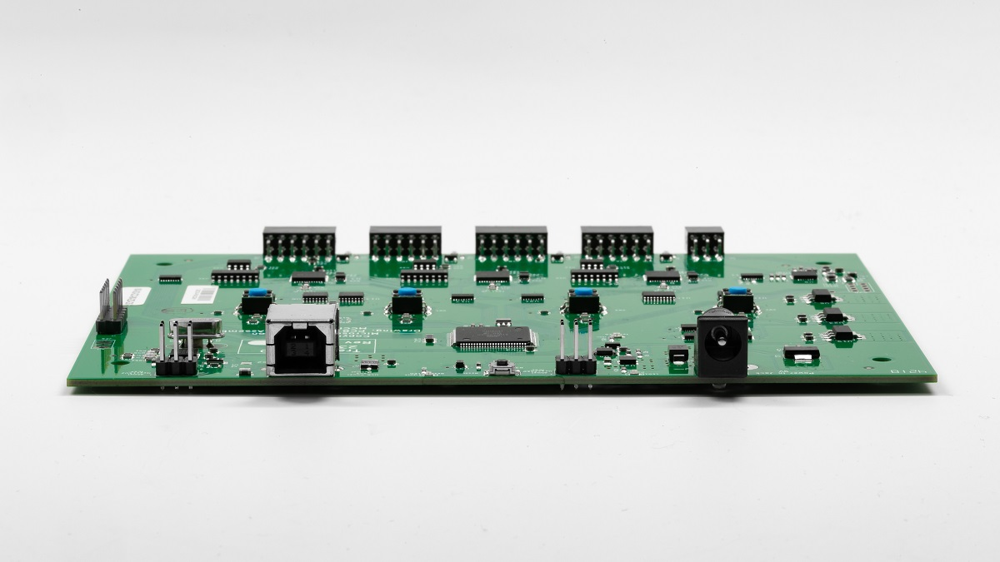
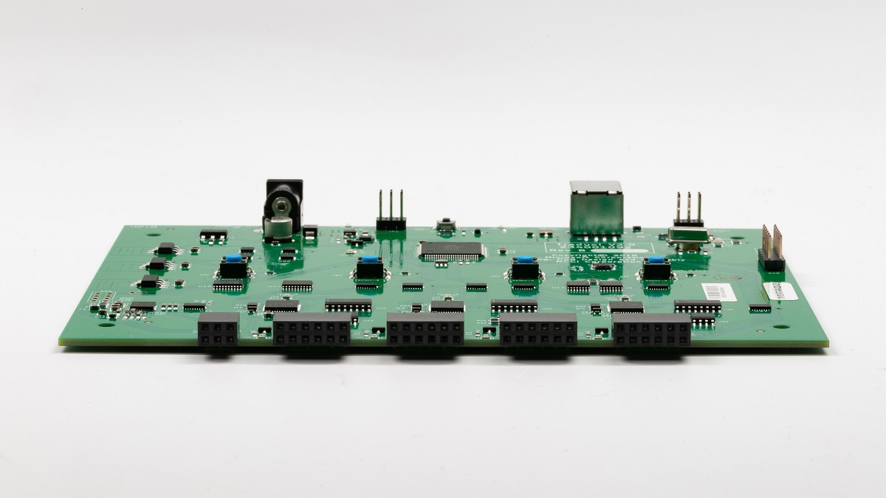

# Setting up BTP
## Hardware setup 
### Connecting Traduci to the PC 
Using the supplied USB A-to-B cable, plug the Traduci into a USB port on the system under test (SUT). Performance is best if the Traduci is plugged directly into an A port on the PC and the Traduci is powered by a [9v, 2A power adapter](https://www.digikey.com/product-detail/en/qualtek/QFWB-18-9-US01/Q1181-ND/8260129) through the barrel connector to the right of the USB connector. Do not connect the Traduci to a USB hub.

### Connecting peripherals to the Traduci 
The Traduci has four 12 pin ports (labeled JA, JB, JC, JD) used for test peripherals.

To plug a peripheral radio into a port on the Traduci, orient the Traduci so that LEDs, buttons, and the printed label on the radio containing the MAC address are face up. Keeping this orientation, plug the peripheral radio in the appropriate 12 Pin port.

> [!NOTE] 
> Some peripherals may only plug into certain ports.  Please refer to the [supported hardware page](testing-BTP-suppported-hardware.md) for more information.

## Software setup 
### Step 1 - Get TAEF

- Follow the instructions to download the WDK from [**docs.microsoft.com**](https://docs.microsoft.com/en-us/windows-hardware/drivers/download-the-wdk#download-icon-step-2-install-wdk-for-windows-10-version-1903).
- After the WDK download and install, the TAEF installation files (*.msi and *.cab files) are located in the `%programfiles%\Windows Kits\8.0\Testing\Runtimes` directory.
- Copy the TAEF folder to the `c:\Taef` directory.

### Step 2 - Getting BTP binaries 

- Download the [BTP software package](testing-BTP-software-package.md).  
- This installs all necessary files to the `c:\BTP` directory.

### Step 3 - Setting up the System 

- Ensure secure boot is [disabled](https://docs.microsoft.com/en-us/windows-hardware/design/device-experiences/oem-secure-boot).
- Ensure BitLocker is disabled.
- Ensure the Traduci board is plugged into the SUT.
- From an elevated command line on the SUT, navigate to the `c:\BTP` directory and run `ConfigureMachineForBTP.bat` to enable test signing
- Reboot the machine under test.

### Step 4 - Start testing
Refer to [BTP tests](testing-BTP-Tests.md) for running test scripts in the package.

## Known issues

- Power: If the device is plugged into a non-powered hub or VCC is not able to supply 5V intermittent failures may be seen. Please remedy by using a powered USB hub or use a 9V AC-DC Barrel adapter.
