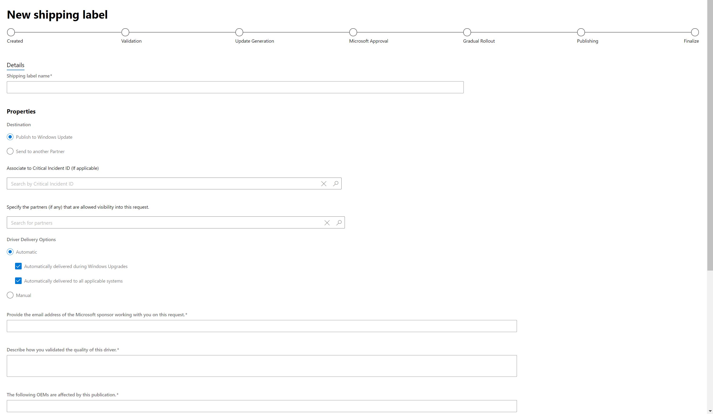

# Publish a driver to Windows Update

To publish a driver to Windows Update, [create a hardware submission](create-a-new-hardware-submission.md) and then follow the steps below.

1. [Find the hardware submission](manage-your-hardware-submissions.md) that contains the driver you want to distribute.

2. Go to the **Distribution** section of the hardware submission and select **New shipping label**.

   

3. On the shipping label page, go to the **Details** section and enter a name for the shipping label in the **Shipping label name** field. This name allows you to organize and search for your shipping labels.

4. In the **Properties** section, complete the following information:

   <table>
   <colgroup>
   <col width="50%" />
   <col width="50%" />
   </colgroup>
   <thead>
   <tr class="header">
   <th>Field</th>
   <th>Description</th>
   </tr>
   </thead>
   <tbody>
   <tr class="odd">
   <td>
<strong>Destination</strong>
</td>
   <td>
Select <strong>Publish to Windows Update</strong> to publish your driver to Windows Update. If you want to create a shared shipping label that allows you to share your driver with a partner, see <a href="sharing-drivers-with-your-partners.md" data-raw-source="[Share a driver with a partner](sharing-drivers-with-your-partners.md)">Share a driver with a partner</a>.

   

   <strong>Note</strong>  Shared drivers can only be shared by the organization that originally created it. An organization that receives a shared driver cannot share it again.
   

   

     
   
</td>
   </tr>
   <tr class="even">
   <td>
<strong>Specify the partner (if any) that is allowed visibility into this request</strong>
</td>
   <td>
Enter a partner that you want to have read-only permissions to your driver and shipping label. Use this field when you want a partner to be aware of this shipping label request, such as when you publish a driver on their behalf. For more information, see <a href="/previous-versions/mt786462(v=vs.85)" data-raw-source="[Publish a driver on behalf of a partner](/previous-versions/mt786462(v=vs.85))">Publish a driver on behalf of a partner</a>.
</td>
   </tr>
   <tr class="odd">
   <td>
<strong>Driver Delivery Options</strong>
</td>
   <td>
By default, drivers on Windows Update are marked as <strong>Automatic</strong>. This means that a driver is delivered automatically on upgrades and for every applicable system. When selecting only <strong>‘Automatically delivered during Windows Updates’</strong> the driver is defined as Dynamic Driver and will be delivered only during OS upgrades. By selecting only <strong>‘Automatically delivered to all applicable systems’</strong> will deliver the driver immediately to all applicable systems once it is released.

   
When selecting <strong>Manual</strong> in Windows Version 1909 and below, the driver is automatically delivered only if the device does not have a driver installed already or only has a generic driver.

   
Starting with Windows 10 Version 2004, drivers with a <strong>Manual</strong> shipping label will not be automatically delivered in any scenario. To access the best matching <strong>Optional/Manual</strong> driver a user can go to <strong>‘Settings > Update & Security > Windows Update > View optional updates > Driver updates‘</strong>.
</td>
   </tr>
   </tbody>
   </table>

   

5. In the **Targeting** section, select the driver package that you want to publish.

6. After you select your driver package, **Select PNPs** becomes available. Select the hardware IDs you want to target. You can search for a specific hardware ID or operating system by using the search boxes above the list of hardware IDs.

   To target all listed hardware IDs, select **Publish All**.

   To target specific hardware IDs, find each desired hardware ID and select **Publish**.

   If you targeted all hardware IDs and want to remove them, select **Expire All**.

   To remove targeting for specific hardware IDs, find each hardware ID and select **Expire**.

   

7. If you want to add Computer Hardware IDs (CHIDs), enter each CHID into the text box and select **Add CHID(s)**. To bulk add multiple CHIDs, ensure that each CHID is separated by a newline, select **Add multiple CHIDs**, and paste your CHIDs into the text box. You can view all added CHIDs in the list below the text box. To remove a CHID from the list, select **Remove**

>[!IMPORTANT]
> CHIDs are not supported for the following versions of windows:
> * Windows 8.1 or earlier
> * Windows Server 2012 R2 or earlier
>
> If your driver targets either of these operating systems, create two shipping labels: one for Windows 10 (where you can add CHIDs) and one for down-level operating systems (where no CHIDs will be added).

8. If you wish to limit public disclosure of your Shipping Label in the Windows Update Catalog and WSUS Catalog, check the **Limit Public Disclosure of this Shipping Label information.** box.  

   

   Your driver will still be published and downloadable from Windows Update but will not show up in either of the public catalog lists.

9. If your driver targets Windows 10 in S mode, you must select both boxes, confirming the following:

   * Your driver is compatible with and follows the driver policies outlined in the [Windows 10 in S mode Driver Requirements](../install/windows10sdriverrequirements.md).
   * You verify that your driver follows the additional code integrity policies outlined in the Windows 10 in S mode guidelines.
   * Your driver does not contain any non-Microsoft UI components or applications in the driver package.

   

10. Select **Publish** to send your request to Windows Update. If you do not want to publish the shipping label right now, you can select **Save**. You can publish the shipping label later by either opening the shipping label and selecting **Publish**, or you can select **Publish all pending** from the hardware submission page. Note that selecting **Publish all pending** will publish all unpublished shipping labels.

