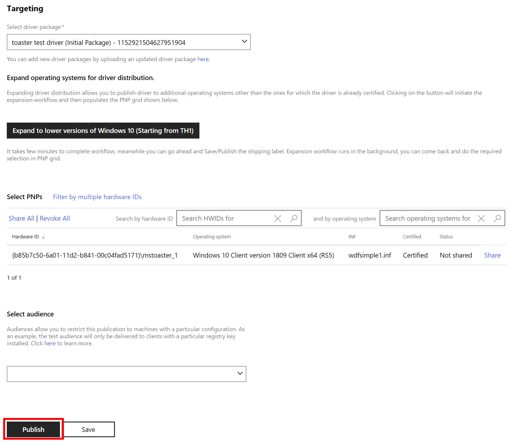

# Share a driver with a partner

To share a driver with one of your partners, [create a hardware submission](create-a-new-hardware-submission.md) and follow the steps below.

**Note**  Shared drivers can only be shared by the organization that originally created it. An organization that receives a shared driver cannot share it again.

 

1. [Find the hardware submission](manage-your-hardware-submissions.md) that contains the driver you want to share.

2. Go to the **Distribution** section of the hardware submission and select **New shipping label**.

   

3. On the shipping label page, go to the **Details** section and enter a name for the shipping label in the **Shipping label name** field. This name is private and will not be visible by your partner. The name allows you to organize and search for your shipping labels.

   

4. In the **Properties** section, complete the following information:

   <table>
   <colgroup>
   <col width="50%" />
   <col width="50%" />
   </colgroup>
   <thead>
   <tr class="header">
   <th>Field</th>
   <th>Description</th>
   </tr>
   </thead>
   <tbody>
   <tr class="odd">
   <td>
<strong>Destination</strong>
</td>
   <td>
Select <strong>Send to another Partner</strong> to share your driver with a partner. If you want to create a shipping label for Windows Update, see <a href="publish-a-driver-to-windows-update.md" data-raw-source="[Publish a driver to Windows Update](publish-a-driver-to-windows-update.md)">Publish a driver to Windows Update</a>.
</td>
   </tr>
   <tr class="even">
   <td>
<strong>Who is publishing?</strong>
</td>
   <td>
Search for the company name of your partner, and select it.
</td>
   </tr>
   <tr class="odd">
   <td>
<strong>Required CHID targeting by receiver</strong>
</td>
   <td>
This option forces your partner to apply CHIDs to any publication requests they create based on your driver. This allows you to protect your users when a Hardware ID may be shared among many partner companies.
</td>
   </tr>
   </tbody>
   </table>
   
5. In the **Targeting** section, select the driver package that you want to share.

   

6. After you select your driver package, the **Select PNPs** grid becomes available. You can search for a specific hardware ID or operating system by using the search box above the list of hardware IDs.  Your partner is limited to the hardware ID values you share for any publications they create. 

   -   To target all listed hardware IDs, select **Share All**.

   -   To target specific hardware IDs, find each desired hardware ID and select **Share**.

   -   If you targeted all hardware IDs and want to remove them, select **Revoke All**.

   -   To remove targeting for specific hardware IDs, find each hardware ID and select **Revoke**.

7. Select **Publish** at the very bottom to finalize the sharing of the driver. If you do not want to publish the shipping label right now, you can select **Save**. You can publish the shipping label later by either opening the shipping label and selecting **Publish**, or you can select **Publish all pending** from the hardware submission page. Note that selecting **Publish all pending** will publish all unpublished shipping labels.

## Revoke/Revoke All:  

Revoking a hardware ID from a shared shipping label will do the following.

1.  The existing Submission ID on the receiver's end will be deprecated.

2.  A new Private Product ID and Submission ID with the adjusted hardware IDs will be shared with your partner.  This new entity will have the same Shared Product ID.  If you selected **Revoke All** then all hardware IDs would be removed.

3.  When your partner tries to create a **NEW** shipping label for Windows Update, their list of available hardware IDs will reflect your changes and only list those hardware IDs you have shared.  In the **Revoke All** case, their hardware ID grid would be empty.

> [!NOTE]
> If your partner has already published their shared shipping labels to Windows Update, revoking a hardware ID **does not remove** their existing item from the Windows Update Catalog.  It remains published until that partner expires it.
>
> Existing shipping labels created by your partner are only allowed to expire content on a deprecated shipping label.
>
> The signed driver and DUA Shell packages from a deprecated shipping label can still be downloaded by your partner.
>
> Sharing and revoking a hardware ID does not modify your original INF.
