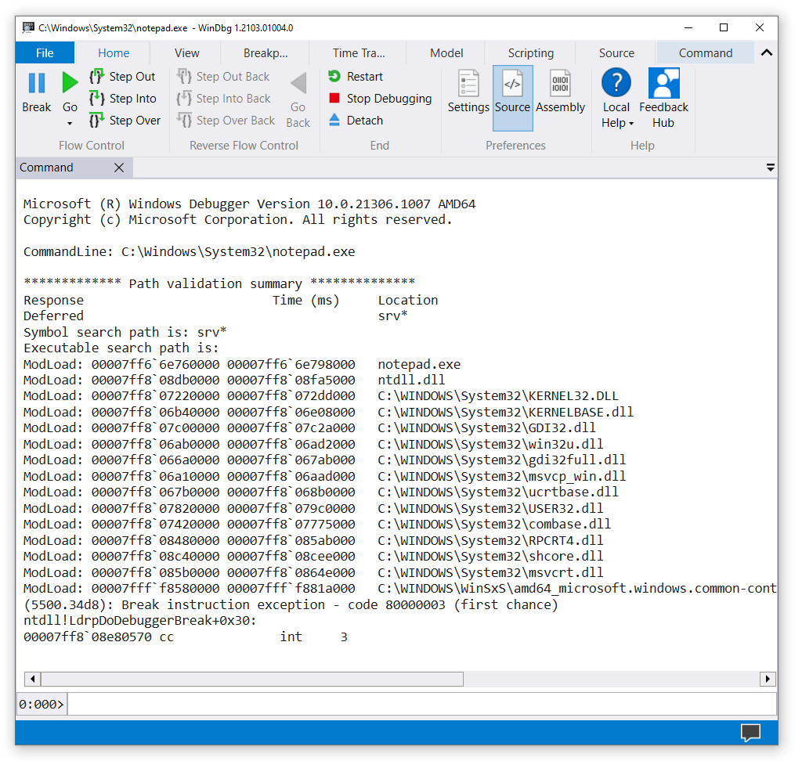

# Getting Started with WinDbg (User-Mode)

WinDbg is a kernel-mode and user-mode debugger that is included in Debugging Tools for Windows. Here we provide hands-on exercises that will help you get started using WinDbg as a user-mode debugger.

For information about how to get Debugging Tools for Windows, see [Debugging Tools for Windows (WinDbg, KD, CDB, NTSD)](https://go.microsoft.com/fwlink/p?linkid=223405). 

After you have installed the debugging tools, locate the installation directories for 64-bit (x64) and 32-bit (x86) versions of the tools. For example:

-   C:\\Program Files (x86)\\Windows Kits\\8.1\\Debuggers\\x64
-   C:\\Program Files (x86)\\Windows Kits\\8.1\\Debuggers\\x86

## <span id="Launch_Notepad_and_attach_WinDbg"></span><span id="launch_notepad_and_attach_windbg"></span><span id="LAUNCH_NOTEPAD_AND_ATTACH_WINDBG"></span>Launch Notepad and attach WinDbg

1.  Navigate to your installation directory, and open WinDbg.exe.

2.  The debugger documentation is also available on line [here](https://go.microsoft.com/fwlink/p?linkid=223405).

3.  On the **File** menu, choose **Open Executable**. In the Open Executable dialog box, navigate to the folder that contains notepad.exe (for example, C:\\Windows\\System32). For **File name**, enter notepad.exe. Click **Open**.

    

4.  Near the bottom of the WinDbg window, in the command line, enter this command:

    [.sympath srv\*](https://go.microsoft.com/fwlink/p?linkid=399238)

    The output is similar to this:

    ```dbgcmd
    Symbol search path is: srv*
    Expanded Symbol search path is: cache*;SRV
    ```

    The symbol search path tells WinDbg where to look for symbol (PDB) files. The debugger needs symbol files to obtain information about code modules (function names, variable names, and the like).

    Enter this command, which tells WinDbg to do its initial finding and loading of symbol files:

    [.reload](https://go.microsoft.com/fwlink/p?linkid=399239)

5.  To see the symbols for the Notepad.exe module, enter this command:

    [x notepad!*](https://go.microsoft.com/fwlink/p?linkid=399240)

    **Note**  If you don't see any output, enter [**.reload**](https://go.microsoft.com/fwlink/p?linkid=399239) again.

    To see symbols in the Notepad.exe module that contain main, enter this command:

    [x notepad!\*main\*](https://go.microsoft.com/fwlink/p?linkid=399240)
 
    The output is similar to this:

    ```dbgcmd
    000000d0`428ff7e8 00007ff6`3282122f notepad!WinMain
    ...
    ```

6.  To put a breakpoint at notepad!WinMain, enter this command:

    [bu notepad!WinMain](https://go.microsoft.com/fwlink/p?linkid=399390)

    To verify that your breakpoint was set, enter this command:

    [bl](https://go.microsoft.com/fwlink/p?linkid=399391)

    The output is similar to this:

    ```dbgcmd
    0 e 00007ff6`32825f64     0001 (0001)  0:**** notepad!WinMain
    ```

7.  To start Notepad running, enter this command:

    [g](https://go.microsoft.com/fwlink/p?linkid=399388)

    Notepad runs until it comes to the **WinMain** function, and then breaks in to the debugger.

    To see a list of code modules that are loaded in the Notepad process, enter this command:

    [lm](https://go.microsoft.com/fwlink/p?linkid=399237)

    The output is similar to this:

    ```dbgcmd
    0:000> lm
    start             end                 module name
    00007ff6`32820000 00007ff6`3285a000   notepad    (pdb symbols)          C:\...\notepad.pdb
    00007ffc`ab7e0000 00007ffc`ab85b000   WINSPOOL   (deferred)             
    00007ffc`aba10000 00007ffc`abc6a000   COMCTL32   (deferred)             
    00007ffc`adea0000 00007ffc`adf3f000   SHCORE     (deferred)             
    00007ffc`af490000 00007ffc`af59f000   KERNELBASE   (deferred)             
    00007ffc`af7d0000 00007ffc`af877000   msvcrt     (deferred)             
    00007ffc`af880000 00007ffc`b0c96000   SHELL32    (deferred)             
    00007ffc`b0e40000 00007ffc`b0ef7000   OLEAUT32   (deferred)             
    00007ffc`b0f00000 00007ffc`b0f57000   sechost    (deferred)             
    00007ffc`b0f60000 00007ffc`b1005000   ADVAPI32   (deferred)             
    00007ffc`b1010000 00007ffc`b1155000   GDI32      (deferred)             
    00007ffc`b1160000 00007ffc`b1296000   RPCRT4     (deferred)             
    00007ffc`b12a0000 00007ffc`b1411000   USER32     (deferred)             
    00007ffc`b1420000 00007ffc`b15f6000   combase    (deferred)             
    00007ffc`b16c0000 00007ffc`b17f9000   MSCTF      (deferred)             
    00007ffc`b1800000 00007ffc`b189a000   COMDLG32   (deferred)             
    00007ffc`b18a0000 00007ffc`b18f1000   SHLWAPI    (deferred)             
    00007ffc`b1b60000 00007ffc`b1cd8000   ole32      (deferred)             
    00007ffc`b1cf0000 00007ffc`b1e2a000   KERNEL32   (pdb symbols)          C:\...\kernel32.pdb
    00007ffc`b1eb0000 00007ffc`b1ee4000   IMM32      (deferred)             
    00007ffc`b1f50000 00007ffc`b20fa000   ntdll      (private pdb symbols)  C:\...\ntdll.pdb
    ```

    To see a stack trace, enter this command:

    [k](https://go.microsoft.com/fwlink/p?linkid=399389)

    The output is similar to this:

    ```dbgcmd
    Breakpoint 0 hit
    notepad!WinMain:
    00007ff6`32825f64 488bc4          mov     rax,rsp
    0:000> k
    Child-SP          RetAddr           Call Site
    00000048`4e0cf6a8 00007ff6`3282122f notepad!WinMain
    00000048`4e0cf6b0 00007ffc`b1cf16ad notepad!WinMainCRTStartup+0x1a7
    00000048`4e0cf770 00007ffc`b1fc4629 KERNEL32!BaseThreadInitThunk+0xd
    00000048`4e0cf7a0 00000000`00000000 ntdll!RtlUserThreadStart+0x1d ...
    ```

8.  To start Notepad running again, enter this command:

    [g](https://go.microsoft.com/fwlink/p?linkid=399388)

9.  To break in to Notepad, choose **Break** from the **Debug** menu.

10. To set and verify a breakpoint at **ZwWriteFile**, enter these commands:

    [bu ntdll!ZwWriteFile](https://go.microsoft.com/fwlink/p?linkid=399390)

    [bl](https://go.microsoft.com/fwlink/p?linkid=399391)

11. Enter [g](https://go.microsoft.com/fwlink/p?linkid=399388) to start Notepad running again. In the Notepad window, enter some text and choose **Save** from the **File** menu. The running code breaks in when it comes to **ZwCreateFile**. Enter [k](https://go.microsoft.com/fwlink/p?linkid=399389) to see the stack trace.

    

    In the WinDbg window, just to the left of the command line, notice the processor and thread numbers. In this example the current processor number is 0, and the current thread number is 11. So we are looking at the stack trace for thread 11 (which happens to be running on processor 0).

12. To see a list of all threads in the Notepad process, enter this command (the tilde):

    [~](https://go.microsoft.com/fwlink/p?linkid=399392)

    The output is similar to this:

    ```dbgcmd
    0:011> ~
       0  Id: 10c8.128c Suspend: 1 Teb: 00007ff6`31cdd000 Unfrozen
       1  Id: 10c8.1a10 Suspend: 1 Teb: 00007ff6`31cdb000 Unfrozen
       2  Id: 10c8.1850 Suspend: 1 Teb: 00007ff6`31cd9000 Unfrozen
       3  Id: 10c8.1774 Suspend: 1 Teb: 00007ff6`31cd7000 Unfrozen
       4  Id: 10c8.1e80 Suspend: 1 Teb: 00007ff6`31cd5000 Unfrozen
       5  Id: 10c8.10ac Suspend: 1 Teb: 00007ff6`31cd3000 Unfrozen
       6  Id: 10c8.13a4 Suspend: 1 Teb: 00007ff6`31bae000 Unfrozen
       7  Id: 10c8.2b4 Suspend: 1 Teb: 00007ff6`31bac000 Unfrozen
       8  Id: 10c8.1df0 Suspend: 1 Teb: 00007ff6`31baa000 Unfrozen
       9  Id: 10c8.1664 Suspend: 1 Teb: 00007ff6`31ba8000 Unfrozen
      10  Id: 10c8.15e4 Suspend: 1 Teb: 00007ff6`31ba6000 Unfrozen
    . 11  Id: 10c8.8bc Suspend: 1 Teb: 00007ff6`31ba4000 Unfrozen
    ```

    In this example, there are 12 threads with indexes 0 through 11.

13. To look at the stack trace for thread 0, enter these commands:

    [~0s](https://go.microsoft.com/fwlink/p?linkid=399393)

    [k](https://go.microsoft.com/fwlink/p?linkid=399389)

    The output is similar to this:

    ```dbgcmd
    0:011> ~0s
    USER32!SystemParametersInfoW:
    00007ffc`b12a4d20 48895c2408      mov     qword ptr [rsp+8], ...
    0:000> k
    Child-SP          RetAddr           Call Site
    00000033`d1e9da48 00007ffc`adfb227d USER32!SystemParametersInfoW
    (Inline Function) --------`-------- uxtheme!IsHighContrastMode+0x1d
    00000033`d1e9da50 00007ffc`adfb2f12 uxtheme!IsThemeActive+0x4d
    ...
    00000033`d1e9f810 00007ffc`b1cf16ad notepad!WinMainCRTStartup+0x1a7
    00000033`d1e9f8d0 00007ffc`b1fc4629 KERNEL32!BaseThreadInitThunk+0xd
    00000033`d1e9f900 00000000`00000000 ntdll!RtlUserThreadStart+0x1d
    ```

14. To quit debugging and detach from the Notepad process, enter this command:

    [qd](https://go.microsoft.com/fwlink/p?linkid=399394)

## <span id="Launch_your_own_application_and_attach_WinDbg"></span><span id="launch_your_own_application_and_attach_windbg"></span><span id="LAUNCH_YOUR_OWN_APPLICATION_AND_ATTACH_WINDBG"></span>Launch your own application and attach WinDbg


Suppose you have written and built this small console application.

```dbgcmd
...
void MyFunction(long p1, long p2, long p3)
{
    long x = p1 + p2 + p3;
    long y = 0;
    y = x / p2;
}

void main ()
{
    long a = 2;
    long b = 0;
    MyFunction(a, b, 5);
}
```

For this exercise, we will assume that the built application (MyApp.exe) and the symbol file (MyApp.pdb) are in C:\\MyApp\\x64\\Debug. We will also assume that the application source code is in C:\\MyApp\\MyApp.

1.  Open WinDbg.

2.  On the **File** menu, choose **Open Executable**. In the Open Executable dialog box, navigate to C:\\MyApp\\x64\\Debug. For **File name**, enter MyApp.exe. Click **Open**.
3.  Enter these commands:

    .symfix

    .sympath+ C:\\MyApp\\x64\\Debug

    Now WinDbg knows where to find symbols and source code for your application.

4.  Enter these commands:

    [.reload](https://go.microsoft.com/fwlink/p?linkid=399239)

    [bu MyApp!main](https://go.microsoft.com/fwlink/p?linkid=399390)

    [g](https://go.microsoft.com/fwlink/p?linkid=399388)

    Your application breaks in to the debugger when it comes to its **main** function.

    WinDbg displays your source code and the Command window.

    

5.  On the **Debug** menu, choose **Step Into** (or press **F11**). Continue stepping until you have stepped into **MyFunction**. When you step into the line `y = x / p2`, your application will crash and break in to the debugger. The output is similar to this:

    ```dbgcmd
    (1450.1424): Integer divide-by-zero - code c0000094 (first chance)
    First chance exceptions are reported before any exception handling.
    This exception may be expected and handled.
    MyApp!MyFunction+0x44:
    00007ff6`3be11064 f77c2428    idiv  eax,dword ptr [rsp+28h] ss:00000063`2036f808=00000000
    ```

6.  Enter this command:

    [!analyze -v](https://go.microsoft.com/fwlink/p?linkid=399396)

    WinDbg displays an analysis of the problem (division by 0 in this case).

    ```dbgcmd
    FAULTING_IP: 
    MyApp!MyFunction+44 [c:\myapp\myapp\myapp.cpp @ 7]
    00007ff6`3be11064 f77c2428        idiv    eax,dword ptr [rsp+28h]

    EXCEPTION_RECORD:  ffffffffffffffff -- (.exr 0xffffffffffffffff)
    ExceptionAddress: 00007ff63be11064 (MyApp!MyFunction+0x0000000000000044)
       ExceptionCode: c0000094 (Integer divide-by-zero)
      ExceptionFlags: 00000000
    NumberParameters: 0
    ...
    STACK_TEXT:  
    00000063`2036f7e0 00007ff6`3be110b8 : ... : MyApp!MyFunction+0x44
    00000063`2036f800 00007ff6`3be1141d : ... : MyApp!main+0x38
    00000063`2036f840 00007ff6`3be1154e : ... : MyApp!__tmainCRTStartup+0x19d
    00000063`2036f8b0 00007ffc`b1cf16ad : ... : MyApp!mainCRTStartup+0xe
    00000063`2036f8e0 00007ffc`b1fc4629 : ... : KERNEL32!BaseThreadInitThunk+0xd
    00000063`2036f910 00000000`00000000 : ... : ntdll!RtlUserThreadStart+0x1d

    STACK_COMMAND: dt ntdll!LdrpLastDllInitializer BaseDllName ;dt ntdll!LdrpFailureData ;.cxr 0x0 ;kb

    FOLLOWUP_IP: 
    MyApp!MyFunction+44 [c:\myapp\myapp\myapp.cpp @ 7]
    00007ff6`3be11064 f77c2428        idiv    eax,dword ptr [rsp+28h]

    FAULTING_SOURCE_LINE:  c:\myapp\myapp\myapp.cpp

    FAULTING_SOURCE_FILE:  c:\myapp\myapp\myapp.cpp

    FAULTING_SOURCE_LINE_NUMBER:  7

    FAULTING_SOURCE_CODE:  
         3: void MyFunction(long p1, long p2, long p3)
         4: {
         5:     long x = p1 + p2 + p3;
         6:     long y = 0;
    >    7:  y = x / p2;
         8: }
         9: 
        10: void main ()
        11: {
        12:     long a = 2;
    ...
    ```

## <span id="Summary_of_commands"></span><span id="summary_of_commands"></span><span id="SUMMARY_OF_COMMANDS"></span>Summary of commands


-   **Contents** command on the **Help** menu
-   [.sympath (Set Symbol Path)](https://go.microsoft.com/fwlink/p?linkid=399238)
-   [.reload (Reload Module)](https://go.microsoft.com/fwlink/p?linkid=399239)
-   [x (Examine Symbols)](https://go.microsoft.com/fwlink/p?linkid=399240)
-   [g (Go)](https://go.microsoft.com/fwlink/p?linkid=399388)
-   **Break** command on the **Debug** menu
-   [lm (List Loaded Modules)](https://go.microsoft.com/fwlink/p?linkid=399237)
-   [k (Display Stack Backtrace)](https://go.microsoft.com/fwlink/p?linkid=399389)
-   [bu (Set Breakpoint)](https://go.microsoft.com/fwlink/p?linkid=399390)
-   [bl (Breakpoint List)](https://go.microsoft.com/fwlink/p?linkid=399390)
-   [~ (Thread Status)](https://go.microsoft.com/fwlink/p?linkid=399392)
-   [~s (Set Current Thread)](https://go.microsoft.com/fwlink/p?linkid=399393)
-   [.sympath+ (Set Symbol Path) append to existing symbol path](https://go.microsoft.com/fwlink/p?linkid=399238)
-   [.srcpath (Set Source Path)](https://go.microsoft.com/fwlink/p?linkid=399395)
-   **Step Into** command on the **Debug** menu (**F11**)
-   [!analyze -v](https://go.microsoft.com/fwlink/p?linkid=399396)
-   [qd (Quit and Detach)](https://go.microsoft.com/fwlink/p?linkid=399394)

## <span id="related_topics"></span>Related topics


[Getting Started with WinDbg (Kernel-Mode)](getting-started-with-windbg--kernel-mode-.md)

[Debugger Operation](https://go.microsoft.com/fwlink/p?linkid=399247)

[Debugging Techniques](https://go.microsoft.com/fwlink/p?linkid=399248)

[Debugging Tools for Windows (WinDbg, KD, CDB, NTSD)](https://go.microsoft.com/fwlink/p?linkid=223405)

 

 


