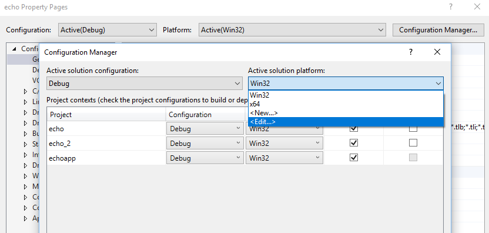

# Building Arm64 Drivers with the WDK

Starting with WDK version 10.0.26100.1 (released May 22, 2024), the WDK now supports development, testing, and deployment of drivers on Arm64 machines.  The WDK can be installed and run natively on Arm64 hardware, in addition to the previously supported emulation of x86 KMDF/UMDF2 drivers on Arm64 hardware.  There is also support for debugging and deployment of drivers to an Arm64 target machine from both Arm64 and x64 host machines.  The process of installing the WDK on Arm64 machines will automatically identify and install all the necessary dependencies including build tools, binaries, and libraries.

This page describes how to build an Arm64 driver with the WDK.

## Setup

1. Download [Visual Studio 2022](https://visualstudio.microsoft.com/downloads/).  You'll need at minimum version 17.0.0 or later.  Ensure that you have the following components installed:

    * MSVC v143 - VS 2022 C++ ARM64/ARM64EC Spectre-mitigated libs (Latest)
    * MSVC v143 - VS 2022 C++ x64/x86 Spectre-mitigated libs (Latest)
    * C++ ATL for latest v143 build tools with Spectre Mitigations (ARM64/ARM64EC)
    * C++ ATL for latest v143 build tools with Spectre Mitigations (x86 & x64)
    * C++ MFC for latest v143 build tools with Spectre Mitigations (ARM64/ARM64EC)
    * C++ MFC for latest v143 build tools with Spectre Mitigations (x86 & x64)

1.	Install and restart Visual Studio.
1.  Download the [Windows SDK](https://developer.microsoft.com/windows/downloads/windows-sdk).  Ensure that you have SDK version 16299 (Windows 10, version 1709) or later.
1.	Download the [WDK](../download-the-wdk.md).  Ensure that you have WDK version 16299 or later.

## Building an Arm64 Driver with the WDK

1.	In Visual Studio, open a driver solution.  You can use your own, or one from the [Windows-driver-samples](https://github.com/Microsoft/Windows-driver-samples) repo.
2.	Select Solutions platform and select **Configuration Manager**.  

  
3.	Under **Active Solution Platform**, select **New**.  


4.	From **Type or Select new Platform**, select **Arm64**.  Copy settings from **Win32**.  Select **OK** and **Close**.  


5.	Select **Arm64** as the target platform and rebuild.

## Known Issues

1. **Integration**:
    - When both the Windows 11, version 24H2 kit and the Windows 11, version 22H2 kit are installed, building a KMDF driver for ARM64 with `TargetPlatformVersion` set to Windows 11, version 22H2 fails due to unresolved external symbols.
    - Debugging drivers within Visual Studio 2022 versions 17.2.0 and 17.3 with the Windows 11, version 22H2 WDK is not possible.

2. **Workarounds**:
    - Update Visual Studio to version 17.4.1 or later to resolve debugging issues.
    - Use WinDbg for debugging if updating Visual Studio is not an option.
    - Consider using an earlier version of Visual Studio if compatibility issues persist.

## Using the Enterprise Windows Driver Kit (EWDK)

1. **EWDK Overview**:
    - The EWDK includes all necessary dependencies and can be used to build drivers without requiring Visual Studio installation.

2. **Building with EWDK**:
    - Use the following command to build the driver:
      ```shell
      Msbuild -p:Configuration=Release/Debug; Platform=ARM64
      ```

## Troubleshooting

1. **Configuration in Visual Studio**:
    - In Visual Studio, configure the driver solution for Arm64 by selecting the Arm64 platform in Configuration Manager and copying settings from Win32.

1. **Testing and Debugging**:
    - Test and debug drivers on a Windows on Arm device or a Windows 11 Arm64 virtual machine.

## See Also

* [Debugging Arm64](../debugger/debugging-Arm64.md)
* [Windows on Arm](/windows/uwp/porting/apps-on-arm)
* [HLK Arm64 Getting Started Guide](/windows-hardware/test/hlk/getstarted/hlk-Arm64-getting-started-guide)
