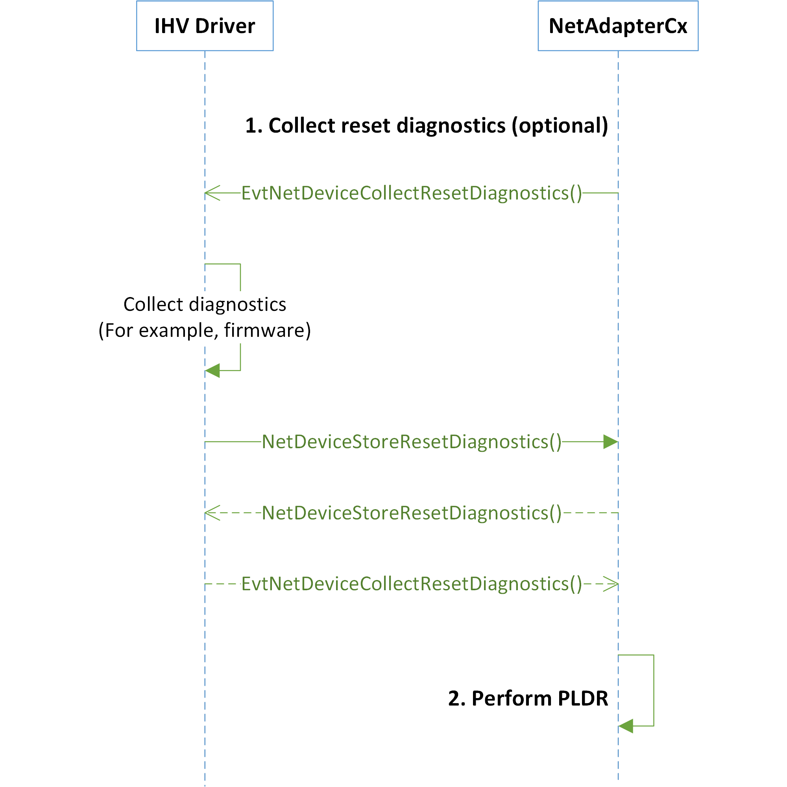

# Recovering unresponsive NIC with platform-level device reset

NetAdapterCx provides an effective way to reset and recover malfunctioning network devices through platform-level device reset (PLDR).
Without rebooting the entire Windows system, the PLDR operation tears down the stack of the affected network device to ensure both its hardware and driver restart from a blank state.
PLDR can be triggered by either the operating system (OS) or the independent hardware vendor (IHV)'s client drivers.
OS side can trigger PLDR if it detects abnormal device behaviors, such like a in-transmit packet is stuck in the driver for too long.
Client driver can also request NetAdapterCx to perform a reset if, for example, IHV's client driver detects its device becomes unresponsive to its control command.
It is recommended that IHVs and OEMs support PLDR for their network devices to provide more user-friendly handling of device failure and recovery.
For more information on PLDR, see [Resetting and recovering a device](https://docs.microsoft.com/windows-hardware/drivers/kernel/resetting-and-recovering-a-device).


## Register optional diagnostics collecting callback
As part of the reset and recovery process initiated by NetAdapterCx, NetAdapterCx gives the client driver an opportunity to collect their own specific diagnostic from the failed device, before the device is being PLDR.
These data will be helpful in post-failure analysis for both Microsoft and IHVs in order to further improve the quality of the product.
If the client driver wants to provide its own diagnostic, it should register for the optional [**NET_DEVICE_RESET_DIAGNOSTICS_CAPABILITIES**](/windows-hardware/drivers/ddi/netdevice/ns-netdevice-net_device_reset_diagnostics_capabilities.md), typically in its [**EVT_WDF_DRIVER_DEVICE_ADD**](https://docs.microsoft.com/windows-hardware/drivers/ddi/wdfdriver/nc-wdfdriver-evt_wdf_driver_device_add) callback.
**NET_DEVICE_RESET_DIAGNOSTICS_CAPABILITIES** contains
* An unique GUID specified by IHV. Later IHV uses this GUID to identify and retrieve the reset diagnostics from a memory dump if available, for examplem, using [.enumtag](https://docs.microsoft.com/windows-hardware/drivers/debugger/-enumtag--enumerate-secondary-callback-data-) command.
* An callback [**EVT_NET_DEVICE_COLLECT_RESET_DIAGNOSTICS**](/windows-hardware/drivers/ddi/netdevice/nc-netdevice-evt_net_device_collect_reset_diagnostics.md) that NetAdapterCx invokes to collect diagnostics. If client driver provides **EVT_NET_DEVICE_COLLECT_RESET_DIAGNOSTICS** callback, NetAdapterCx will invoked it to client driver using a *dedicated* thread.

Here is an example showing how to register for **NET_DEVICE_RESET_DIAGNOSTICS_CAPABILITIES** to NetAdapterCx:
```cpp
EVT_WDF_DRIVER_DEVICE_ADD EvtWdfDriverDeviceAdd;

NTSTATUS EvtWdfDriverDeviceAdd(
    WDFDRIVER Driver,
    PWDFDEVICE_INIT DeviceInit
)
{
    ...

    NET_DEVICE_RESET_DIAGNOSTICS_CAPABILITIES resetResetDiagnosticsCapabilities;
    NET_DEVICE_RESET_DIAGNOSTICS_CAPABILITIES_INIT(
        &resetResetDiagnosticsCapabilities,
        DUMMY_GUID,
        EvtDeviceCollectResetDiagnostics);
    NetDeviceInitSetResetDiagnosticsCapabilitites(DeviceInit, &resetResetDiagnosticsCapabilities);

    ...
}
```

See [**NET_DEVICE_RESET_DIAGNOSTICS_CAPABILITIES_INIT**](/windows-hardware/drivers/ddi/nf-netdevice-net_device_reset_diagnostics_capabilities_init.md) for how to initialize **NET_DEVICE_RESET_DIAGNOSTICS_CAPABILITIES** strucutre, and [**NetDeviceInitSetResetDiagnosticsCapabilitites**](/windows-hardware/drivers/ddi/nf-netdevice-netdeviceinitsetresetdiagnosticscapabilitites.md) for how to advertise **NET_DEVICE_RESET_DIAGNOSTICS_CAPABILITIES** structure to NetAdapterCx.

Reset and recovery sequence can happen at any given time.
Therefore, the client driver's implementation of **EVT_NET_DEVICE_COLLECT_RESET_DIAGNOSTICS** callback should takes this case into consideration.
NetAdapterCx synchronizes the **EVT_NET_DEVICE_COLLECT_RESET_DIAGNOSTICS** callback with other callbacks that might occur during [power-down sequence](power-down-sequence-for-a-netadaptercx-client-driver.md).
Therefore in handling **EVT_NET_DEVICE_COLLECT_RESET_DIAGNOSTICS**, the client driver can assume callbacks like packet queue cancel/stop, releasing hardware, and deleting device object will not happen until **EVT_NET_DEVICE_COLLECT_RESET_DIAGNOSTICS** returns.
The client driver must use extra caution when handling the diagnostics collecting to avoid dead lock, and keep in mind the hardware may already be in failed state.
It's critical for **EVT_NET_DEVICE_COLLECT_RESET_DIAGNOSTICS** to complete as soon as possible, so the rest of PLDR process can proceed.
This callback must be reliable and must return within 3 seconds.

In **EVT_NET_DEVICE_COLLECT_RESET_DIAGNOSTICS** callback, the client driver should submit diagnostics as a flat data buffer to NetAdapterCx by calling the [**NetDeviceStoreResetDiagnostics**](/windows-hardware/drivers/ddi/nf-netdevice-netdevicestoreresetdiagnostics.md) API.
Once **NetDeviceStoreResetDiagnostics** returns, it is fine for IHV drivers to free their reset diagnostics data buffer.

> [!IMPORTANT]
> The **NetDeviceStoreResetDiagnostics** API must be only called in the **EVT_NET_DEVICE_COLLECT_RESET_DIAGNOSTICS** callback.
> It cannot be used to re-submit diagnostics data after previous **NetDeviceStoreResetDiagnostics** returns.
> Violating any one of the cases will result in bugcheck.

> [!IMPORTANT]
> The amount limitation for reset diagnostics is 1 MBytes.

## NetAdapterCx reset and recover sequence
When PLDR is triggered by either the OS or the client driver, the following sequence happens from a client driver's perspective:
1. If the client driver has registered the optional **NET_DEVICE_RESET_DIAGNOSTICS_CAPABILITIES**, NetAdapterCx invokes client driver's implementation of **EVT_NET_DEVICE_COLLECT_RESET_DIAGNOSTICS** callback to collect diagnostics from the failed device, for example, a snapshot of the device firmware. Otherwise, NetAdapterCx will skip this step.
2. NetAdapterCx performs the actual platform-level device reset operation. Hardware will be power recycled and software device stack will be teared down.



NetAdapterCx always invokes **EVT_NET_DEVICE_COLLECT_RESET_DIAGNOSTICS** callback at PASSIVE_LEVEL.
The client driver must calls **NetDeviceStoreResetDiagnostics** API at PASSIVE_LEVEL.
The flat buffer the client driver used to collect reset diagnostics can come from either paged or non-paged pool.

## How a client driver can request PLDR
NetAdapterCx provides [**NetDeviceRequestReset**](/windows-hardware/drivers/ddi/nf-netdevice-netdevicerequestreset.md) API for a client driver to trigger PLDR when it detects device failure.
**NetDeviceRequestReset** returns immidiately to the client driver.
The reset and recovery sequence decribed in [NetAdapterCx reset and recover sequence](#netadaptercx-reset-and-recover-sequence) will be triggered and it is asynchronous to the **NetDeviceRequestReset** call.
Only one PLDR operation can happen at any given time.
Therefore, subseqent calls of **NetDeviceRequestReset** have no effort if a reset and recovery operation has already been in-flight.
If the [power-down sequence](power-down-sequence-for-a-netadaptercx-client-driver.md) has already initiated, calling **NetDeviceRequestReset** has no effect.
