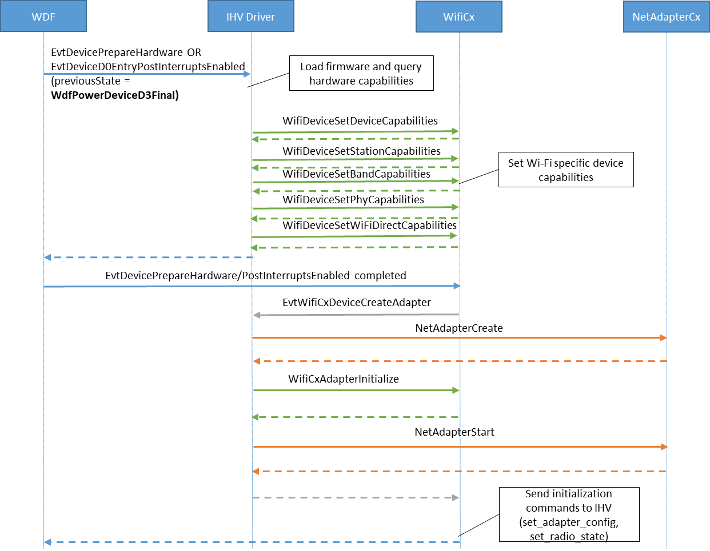
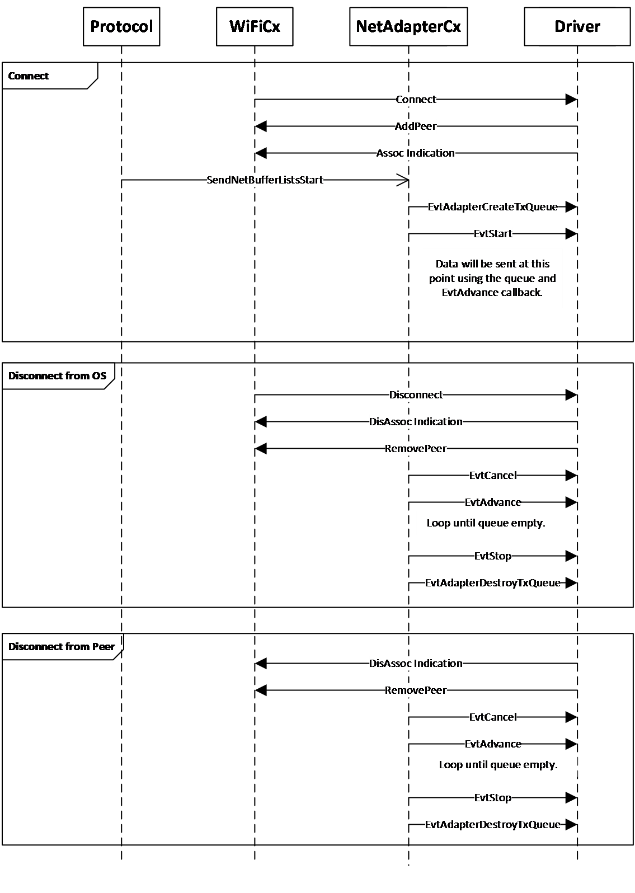

# Writing a WiFiCx client driver

## Device and adapter initialization

In addition to the tasks that NetAdapterCx requires for [NetAdapter device initialization](device-and-adapter-initialization.md), a WiFiCx client driver must also perform the following tasks in its [*EvtDriverDeviceAdd*](/windows-hardware/drivers/ddi/wdfdriver/nc-wdfdriver-evt_wdf_driver_device_add) callback function:

1. Call [**WifiDeviceInitConfig**](/windows-hardware/drivers/ddi/wificx/nf-wificx-wifideviceinitconfig) after calling [**NetDeviceInitConfig**](/windows-hardware/drivers/ddi/netdevice/nf-netdevice-netdeviceinitconfig) but before calling [**WdfDeviceCreate**](/windows-hardware/drivers/ddi/wdfdevice/nf-wdfdevice-wdfdevicecreate), referencing the same [**WDFDEVICE_INIT**](/windows-hardware/drivers/wdf/wdfdevice_init) object passed in by the framework.

2. Call [**WifiDeviceInitialize**](/windows-hardware/drivers/ddi/wificx/nf-wificx-wifideviceinitialize) to register WiFiCx device-specific callback functions, using an initialized [**WIFI_DEVICE_CONFIG**](/windows-hardware/drivers/ddi/wificx/ns-wificx-wifi_device_config) structure and the **WDFDEVICE** object obtained from **WdfDeviceCreate**.

The following example demonstrates how to initialize the WiFiCx device. Error handling has been left out for clarity.

```C++
status = NetDeviceInitConfig(deviceInit);
status = WifiDeviceInitConfig(deviceInit);

// Set up other callbacks such as Pnp and Power policy

status = WdfDeviceCreate(&deviceInit, &deviceAttributes, &wdfDevice);
WIFI_DEVICE_CONFIG wifiDeviceConfig;
WIFI_DEVICE_CONFIG_INIT(&wifiDeviceConfig,
                        WDI_VERSION_LATEST,
                        EvtWifiDeviceSendCommand,
                        EvtWifiDeviceCreateAdapter,
                        EvtWifiDeviceCreateWifiDirectDevice); 

status = WifiDeviceInitialize(wdfDevice, &wifiDeviceConfig);
...
// Get the TLV version that WiFiCx uses to initialize the client's TLV parser/generator
auto peerVersion = WifiDeviceGetOsWdiVersion(wdfDevice);

```

This message flow diagram shows the initialization process.


### Default adapter (station) creation flow

Next, the client driver must set all the Wi-Fi specific device capabilities, typically in the [*EvtDevicePrepareHardware*](/windows-hardware/drivers/ddi/wdfdevice/nc-wdfdevice-evt_wdf_device_prepare_hardware) callback function that follows. If your hardware needs interrupts to be enabled in order to query firmware capabilities, this can be done in [*EvtWdfDeviceD0EntryPostInterruptsEnabled*](/windows-hardware/drivers/ddi/wdfdevice/nc-wdfdevice-evt_wdf_device_d0_entry_post_interrupts_enabled). 

Note that WiFiCx no longer calls **WDI_TASK_OPEN**/**WDI_TASK_CLOSE** to instruct clients to load/unload firmware nor will it query for Wi-Fi capabilities via the **WDI\_GET\_ADAPTER\_CAPABILITIES** command. 

Unlike other types of NetAdapterCx drivers, WiFiCx drivers must not create the NETADAPTER object from within the *EvtDriverDeviceAdd* callback function. Instead, WiFiCx will instruct drivers to create the default NetAdapter (station) later using the [*EvtWifiDeviceCreateAdapter*](/windows-hardware/drivers/ddi/wificx/nc-wificx-evt_wifi_device_create_adapter) callback (after the client’s *EvtDevicePrepareHardware* callback is successful). Furthermore, WiFiCx/WDI no longer calls the **WDI\_TASK\_CREATE\_PORT** command.

In its [*EvtWifiDeviceCreateAdapter*](/windows-hardware/drivers/ddi/wificx/nc-wificx-evt_wifi_device_create_adapter) callback function, the client driver must:

1. Call [**NetAdapterCreate**](/windows-hardware/drivers/ddi/netadapter/nf-netadapter-netadaptercreate) to create the new NetAdapter object.

2. Call [**WifiAdapterInitialize**](/windows-hardware/drivers/ddi/wificx/nf-wificx-wifiadapterinitialize) to initialize the WiFiCx context and associate it with this NetAdapter object.

3. Call [**NetAdapterStart**](/windows-hardware/drivers/ddi/netadapter/nf-netadapter-netadapterstart) to start the adapter.

If this succeeds, WiFiCx will send initialization commands for the device/adapter (for example, [SET\_ADAPTER\_CONFIGURATION](oid-wdi-set-adapter-configuration.md), [TASK\_SET\_RADIO\_STATE](oid-wdi-task-set-radio-state.md), etc.).

For a code example of *EvtWifiDeviceCreateAdapter*, see [Event callback for adapter creation](#event-callback-for-adapter-creation).



## Handling WiFiCx command messages

WiFiCx command messages are based off of the previous WDI model commands for most control path operations. These commands are defined in [WiFiCx Task OIDs](oid-wdi-task-change-operation-mode.md), [WiFiCx Property OIDs](oid-wdi-abort-task.md), and [WiFiCx status indications](ndis-status-wdi-indication-action-frame-received.md). See [WiFiCx message structure](wificx-message-structure.md) for more information.

Commands are exchanged through a set of callback functions provided by the client driver and APIs provided by WiFiCx:

- WiFiCx sends a command message to the client driver by invoking its [*EvtWifiDeviceSendCommand*](/windows-hardware/drivers/ddi/wificx/nc-wificx-evt_wifi_device_send_command) callback function. 

- To retrieve the message, the client driver calls [**WifiRequestGetInOutBuffer**](/windows-hardware/drivers/ddi/wificx/nf-wificx-wifirequestgetinoutbuffer) to get the input/output buffer and buffer lengths. The driver also needs to call [**WifiRequestGetMessageId**](/windows-hardware/drivers/ddi/wificx/nf-wificx-wifirequestgetmessageid) to retrieve the message ID.

- To complete the request, the driver sends the M3 for the command asynchronously by calling [**WifiRequestComplete**](/windows-hardware/drivers/ddi/wificx/nf-wificx-wifirequestcomplete). 

- If the command is a set command and the original request didn't contain a large enough buffer, the client should call [**WifiRequestSetBytesNeeded**](/windows-hardware/drivers/ddi/wificx/nf-wificx-wifirequestsetbytesneeded) to set the required buffer size and then fail the request with status BUFFER\_OVERFLOW.

- If the command is a task command, the client driver needs to later send the associated M4 indication by calling [**WifiDeviceReceiveIndication**](/windows-hardware/drivers/ddi/wificx/nf-wificx-wifidevicereceiveindication) and pass the indication buffer with a WDI header that contains the same message ID as contained in the M1.

- Unsolicited indications are also notified via **WifiDeviceReceiveIndication**, but with the message ID set to **0**.


## Wi-Fi Direct (P2P) support

The following sections describe how WiFiCx drivers can support Wi-Fi Direct.

### Wi-Fi Direct device capabilities

[**WIFI_WIFIDIRECT_CAPABILITIES**](/windows-hardware/drivers/ddi/wificx/ns-wificx-wifi_wifidirect_capabilities) represents all the relevant capabilities that were previously set in WDI via the WDI_P2P_CAPABILITIES and WDI\_AP\_CAPABILITIES TLVs. The client driver calls [**WifiDeviceSetWiFiDirectCapabilities**](/windows-hardware/drivers/ddi/wificx/nf-wificx-wifidevicesetwifidirectcapabilities) to report Wi-Fi direct capabilities to WiFiCx in the set device capabilities phase.
```C++
WIFI_WIFIDIRECT_CAPABILITIES wfdCapabilities = {};

// Set values
wfdCapabilities.ConcurrentGOCount = 1;
wfdCapabilities.ConcurrentClientCount = 1;

// Report capabilities to WiFiCx
WifiDeviceSetWiFiDirectCapabilities(Device, &wfdCapabilities);
```

### Wi-Fi Direct event callback for "WfdDevice"

For Wi-Fi Direct, the "WfdDevice" is a control object with no data path capabilities. Therefore, WiFiCx has a new WDFObject named WIFIDIRECTDEVICE. In their [*EvtWifiDeviceCreateWifiDirectDevice*](/windows-hardware/drivers/ddi/wificx/nc-wificx-evt_wifi_device_create_wifidirectdevice) callback function, client drivers:

- Call [**WifiDirectDeviceCreate**](/windows-hardware/drivers/ddi/wificx/nf-wificx-wifidirectdevicecreate) to create the WIFIDIRECTDEVICE object.
- Call [**WifiDirectDeviceInitialize**](/windows-hardware/drivers/ddi/wificx/nf-wificx-wifidirectdeviceinitialize) to initialize the object. 
- Call [**WifiDirectDeviceGetPortId**](/windows-hardware/drivers/ddi/wificx/nf-wificx-wifidirectdevicegetportid) to determine the port id (which is used in command messages).

This example shows how to create and initialize a WIFIDIRECTDEVICE object.
```C++
NTSTATUS
EvtWifiDeviceCreateWifiDirectDevice(
    WDFDEVICE  Device,
    WIFIDIRECT_DEVICE_INIT * WfdDeviceInit
)
{
    WDF_OBJECT_ATTRIBUTES wfdDeviceAttributes;
    WDF_OBJECT_ATTRIBUTES_INIT_CONTEXT_TYPE(&wfdDeviceAttributes, WIFI_WFDDEVICE_CONTEXT);
    wfdDeviceAttributes.EvtCleanupCallback = EvtWifiDirectDeviceContextCleanup;

    WIFIDIRECTDEVICE wfdDevice;
    NTSTATUS ntStatus = WifiDirectDeviceCreate(WfdDeviceInit, &wfdDeviceAttributes, &wfdDevice);
    if (!NT_SUCCESS(ntStatus))
    {
        TraceEvents(TRACE_LEVEL_ERROR, DBG_DEVICE, "%!FUNC!: WifiDirectDeviceCreate failed, status=0x%x\n", ntStatus);
        return ntStatus;
    }

    ntStatus = WifiDirectDeviceInitialize(wfdDevice);

    if (!NT_SUCCESS(ntStatus))
    {
        TraceEvents(TRACE_LEVEL_ERROR, DBG_DEVICE, "%!FUNC!: WifiDirectDeviceInitialize failed with %!STATUS!\n", ntStatus);
        return ntStatus;
    }

    ntStatus = ClientDriverInitWifiDirectDeviceContext(
        Device,
        wfdDevice,
        WifiDirectDeviceGetPortId(wfdDevice));
    if (!NT_SUCCESS(ntStatus))
    {
        TraceEvents(TRACE_LEVEL_ERROR, DBG_DEVICE, "%!FUNC!: ClientDriverInitWifiDirectDeviceContext failed with %!STATUS!\n", ntStatus);
        return ntStatus;
    }

    return ntStatus;
}
```

### Event callback for adapter creation

Client drivers create the station adapter and WfdRole adapter using the same event callback: [*EvtWifiDeviceCreateAdapter*](/windows-hardware/drivers/ddi/wificx/nc-wificx-evt_wifi_device_create_adapter). 
- Call [**WifiAdapterGetType**](/windows-hardware/drivers/ddi/wificx/nf-wificx-wifiadaptergettype) to determine the adapter type. 
- If the driver needs to query the adapter type from the NETADAPTER_INIT object before the adapter is created, call [**WifiAdapterInitGetType**](/windows-hardware/drivers/ddi/wificx/nf-wificx-wifiadapterinitgettype). 
- Call [**WifiAdapterGetPortId**](/windows-hardware/drivers/ddi/wificx/nf-wificx-wifiadaptergetportid) determine the port ID (used in message commands). 


```C++
NTSTATUS
EvtWifiDeviceCreateAdapter(
    WDFDEVICE Device,
    NETADAPTER_INIT* AdapterInit
)
{
    NET_ADAPTER_DATAPATH_CALLBACKS datapathCallbacks;
    NET_ADAPTER_DATAPATH_CALLBACKS_INIT(&datapathCallbacks,
        EvtAdapterCreateTxQueue,
        EvtAdapterCreateRxQueue);

    NetAdapterInitSetDatapathCallbacks(AdapterInit, &datapathCallbacks);

    WDF_OBJECT_ATTRIBUTES adapterAttributes;
    WDF_OBJECT_ATTRIBUTES_INIT(&adapterAttributes);
    WDF_OBJECT_ATTRIBUTES_INIT_CONTEXT_TYPE(&adapterAttributes, WIFI_NETADAPTER_CONTEXT);
    adapterAttributes.EvtCleanupCallback = EvtAdapterContextCleanup;

    NETADAPTER netAdapter;
    NTSTATUS ntStatus = NetAdapterCreate(AdapterInit, &adapterAttributes, &netAdapter);
    if (!NT_SUCCESS(ntStatus))
    {
        TraceEvents(TRACE_LEVEL_ERROR, DBG_DEVICE, "%!FUNC!: NetAdapterCreate failed, status=0x%x\n", ntStatus);
        return ntStatus;
    }

    ntStatus = WifiAdapterInitialize(netAdapter);

    if (!NT_SUCCESS(ntStatus))
    {
        TraceEvents(TRACE_LEVEL_ERROR, DBG_DEVICE, "%!FUNC!: WifiAdapterInitialize failed with %!STATUS!\n", ntStatus);
        return ntStatus;
    }

    ntStatus = ClientDriverInitDataAdapterContext(
        Device,
        netAdapter,
        WifiAdapterGetType(netAdapter) == WIFI_ADAPTER_EXTENSIBLE_STATION ? EXTSTA_PORT : EXT_P2P_ROLE_PORT,
        WifiAdapterGetPortId(netAdapter));

    if (!NT_SUCCESS(ntStatus))
    {
        TraceEvents(TRACE_LEVEL_ERROR, DBG_DEVICE, "%!FUNC!: ClientDriverInitDataAdapterContext failed with %!STATUS!\n", ntStatus);
        return ntStatus;
    }

    ntStatus = ClientDriverNetAdapterStart(netAdapter);
    if (!NT_SUCCESS(ntStatus))
    {
        TraceEvents(TRACE_LEVEL_ERROR, DBG_DEVICE, "%!FUNC!: ClientDriverNetAdapterStart failed with %!STATUS!\n", ntStatus);
        return ntStatus;
    }

    return ntStatus;
}
```
### Wi-Fi ExemptionAction support in Tx queues

ExemptionAction is a new NetAdapter packet extension that indicates whether the packet is expected to be exempt from any cipher operations performed by the client. Please read the documentation on [usExemptionActionType](/windows-hardware/drivers/ddi/windot11/ns-windot11-dot11_extsta_send_context) for details.

```C++
#include <net/wifi/exemptionaction.h>

typedef struct _WIFI_TXQUEUE_CONTEXT
{
    WIFI_NETADAPTER_CONTEXT* NetAdapterContext;
    LONG NotificationEnabled;
    NET_RING_COLLECTION const* Rings;
    NET_EXTENSION VaExtension;
    NET_EXTENSION LaExtension;
    NET_EXTENSION ExemptionActionExtension;
    CLIENTDRIVER_TCB* PacketContext;
} WIFI_TXQUEUE_CONTEXT, * PWIFI_TXQUEUE_CONTEXT;
WDF_DECLARE_CONTEXT_TYPE_WITH_NAME(WIFI_TXQUEUE_CONTEXT, WifiGetTxQueueContext);

NTSTATUS
EvtAdapterCreateTxQueue(
    _In_ NETADAPTER NetAdapter,
    _Inout_ NETTXQUEUE_INIT* TxQueueInit
)
{
    TraceEvents(TRACE_LEVEL_VERBOSE, DBG_INIT, "-->%!FUNC!\n");

    NTSTATUS status = STATUS_SUCCESS;
    PWIFI_TXQUEUE_CONTEXT txQueueContext = NULL;
    PWIFI_NETADAPTER_CONTEXT netAdapterContext = WifiGetNetAdapterContext(NetAdapter);
    WDF_OBJECT_ATTRIBUTES txAttributes;

    WDF_OBJECT_ATTRIBUTES_INIT(&txAttributes);
    WDF_OBJECT_ATTRIBUTES_INIT_CONTEXT_TYPE(&txAttributes, WIFI_TXQUEUE_CONTEXT);

    txAttributes.EvtDestroyCallback = EvtTxQueueDestroy;

    NET_PACKET_QUEUE_CONFIG queueConfig;
    NET_PACKET_QUEUE_CONFIG_INIT(&queueConfig,
        EvtTxQueueAdvance,
        EvtTxQueueSetNotificationEnabled,
        EvtTxQueueCancel);
    queueConfig.EvtStart = EvtTxQueueStart;
    NETPACKETQUEUE txQueue;
    status =
        NetTxQueueCreate(TxQueueInit,
            &txAttributes,
            &queueConfig,
            &txQueue);

    if (!NT_SUCCESS(status))
    {
        TraceEvents(TRACE_LEVEL_ERROR, DBG_INIT, "NetTxQueueCreate failed, Adapter=0x%p status=0x%x\n", NetAdapter, status);
        goto Exit;
    }

    txQueueContext = WifiGetTxQueueContext(txQueue);

    TraceEvents(TRACE_LEVEL_INFORMATION, DBG_INIT, "NetTxQueueCreate succeeded, Adapter=0x%p, TxQueue=0x%p\n", NetAdapter, txQueue);

    txQueueContext->NetAdapterContext = netAdapterContext;
    txQueueContext->Rings = NetTxQueueGetRingCollection(txQueue);
    netAdapterContext->TxQueue = txQueue;

    NET_EXTENSION_QUERY extensionQuery;
    NET_EXTENSION_QUERY_INIT(
        &extensionQuery,
        NET_FRAGMENT_EXTENSION_VIRTUAL_ADDRESS_NAME,
        NET_FRAGMENT_EXTENSION_VIRTUAL_ADDRESS_VERSION_1,
        NetExtensionTypeFragment);

    NetTxQueueGetExtension(
        txQueue,
        &extensionQuery,
        &txQueueContext->VaExtension);

    if (!txQueueContext->VaExtension.Enabled)
    {
        TraceEvents(
            TRACE_LEVEL_ERROR,
            DBG_INIT,
            "%!FUNC!: Required virtual address extension is missing.");

        status = STATUS_UNSUCCESSFUL;
        goto Exit;
    }

    NET_EXTENSION_QUERY_INIT(
        &extensionQuery,
        NET_FRAGMENT_EXTENSION_LOGICAL_ADDRESS_NAME,
        NET_FRAGMENT_EXTENSION_LOGICAL_ADDRESS_VERSION_1,
        NetExtensionTypeFragment);

    NetTxQueueGetExtension(
        txQueue,
        &extensionQuery,
        &txQueueContext->LaExtension);

    if (!txQueueContext->LaExtension.Enabled)
    {
        TraceEvents(
            TRACE_LEVEL_ERROR,
            DBG_INIT,
            "%!FUNC!: Required logical address extension is missing.");

        status = STATUS_UNSUCCESSFUL;
        goto Exit;
    }

     NET_EXTENSION_QUERY_INIT(
        &extensionQuery,
        NET_PACKET_EXTENSION_WIFI_EXEMPTION_ACTION_NAME,
        NET_PACKET_EXTENSION_WIFI_EXEMPTION_ACTION_VERSION_1,
        NetExtensionTypePacket);

    NetTxQueueGetExtension(
        txQueue,
        &extensionQuery,
        &txQueueContext->ExemptionActionExtension);

    if (!txQueueContext->ExemptionActionExtension.Enabled)
    {
        TraceEvents(
            TRACE_LEVEL_ERROR,
            DBG_INIT,
            "%!FUNC!: Required Exemption Action extension is missing.");

        status = STATUS_UNSUCCESSFUL;
        goto Exit;
    }

    status = InitializeTCBs(txQueue, txQueueContext);

    if (status != STATUS_SUCCESS)
    {
        goto Exit;
    }

Exit:
    TraceEvents(TRACE_LEVEL_VERBOSE, DBG_INIT, "<--%!FUNC! with 0x%x\n", status);

    return status;
}

static
void
BuildTcbForPacket(
    _In_ WIFI_TXQUEUE_CONTEXT const * TxQueueContext,
    _Inout_ CLIENTDRIVER_TCB * Tcb,
    _In_ UINT32 PacketIndex,
    _In_ NET_RING_COLLECTION const * Rings
)
{
    auto const pr = NetRingCollectionGetPacketRing(Rings);
    auto const fr = NetRingCollectionGetFragmentRing(Rings);

    auto const packet = NetRingGetPacketAtIndex(pr, PacketIndex);

    auto const & vaExtension = TxQueueContext->VaExtension;
    auto const & laExtension = TxQueueContext->LaExtension;
    auto const & exemptionActionExtension = TxQueueContext->ExemptionActionExtension;


    auto const packageExemptionAction = WifiExtensionGetExemptionAction(&exemptionActionExtension, PacketIndex);
    Tcb->EncInfo.ExemptionActionType = packageExemptionAction->ExemptionAction;

}

```
### Wi-Fi Direct INI/INF file change

vWifi functionalities have been replaced by the NetAdapter. If you are porting from WDI based driver, the INI/INF should remove the vWIFI related information. 

```INF
Characteristics = 0x84
BusType         = 5
*IfType         = 71; IF_TYPE_IEEE80211
*MediaType      = 16; NdisMediumNative802_11
*PhysicalMediaType = 9; NdisPhysicalMediumNative802_11
NumberOfNetworkInterfaces   = 5; For WIFI DIRECT DEVICE AND ROLE ADAPTER

; TODO: Set this to 0 if your device is not a physical device.
*IfConnectorPresent     = 1     ; true

; In most cases, you can keep these at their default values.
*ConnectionType         = 1     ; NET_IF_CONNECTION_DEDICATED
*DirectionType          = 0     ; NET_IF_DIRECTION_SENDRECEIVE
*AccessType             = 2     ; NET_IF_ACCESS_BROADCAST
*HardwareLoopback       = 0     ; false

[ndi.NT.Wdf]
KmdfService = %ServiceName%, wdf

[wdf]
KmdfLibraryVersion      = $KMDFVERSION$
```

## NetAdapter data path change 

### Setting up multiple Tx queues

By default, NetAdapterCx will create one Tx queue for all packets intended for a NetAdapter. 

If a driver needs to support multiple Tx queues for QOS or needs to set up different queues for different peers, it can do so by setting up the appropriate DEMUX properties. If demux properties are added, the Tx queue count is the product of the maximum number of peers and maximum number of tids, plus **1** (for broadcast/multicast).

#### Multiple queues for QOS
Before using a NETADAPTER_INIT * object to create a NETADAPTER, the client driver should add WMMINFO demux to it:

```C++
...
WIFI_ADAPTER_TX_DEMUX wmmInfoDemux;
WIFI_ADAPTER_TX_WMMINFO_DEMUX_INIT(&wmmInfoDemux);
WifiAdapterInitAddTxDemux(adapterInit, &wmmInfoDemux);
```

This will cause the translator to create up to 8 Tx queues on demand, depending on the NBL WlanTagHeader::WMMInfo value.

The client driver should query the priority that the framework will use for this queue from [*EvtPacketQueueStart*](/windows-hardware/drivers/ddi/netpacketqueue/nc-netpacketqueue-evt_packet_queue_start):

```C++
auto const priority = WifiTxQueueGetDemuxWmmInfo(queue);
```
All packets placed to this queue between **EvtStart** and **EvtStop** will have the given priority.

#### Multiple queues for peers
Before using a NETADAPTER_INIT * object to create a NETADAPTER, the client driver should add PEER_ADDRESS demux to it:

```C++
...
WIFI_ADAPTER_TX_DEMUX peerInfoDemux;
WIFI_ADAPTER_TX_PEER_ADDRESS_DEMUX_INIT(&peerInfoDemux, maxNumOfPeers);
WifiAdapterInitAddTxDemux(adapterInit, &peerInfoDemux);
```
The client driver should query the peer address that the framework will use for this queue from [*EvtPacketQueueStart*](/windows-hardware/drivers/ddi/netpacketqueue/nc-netpacketqueue-evt_packet_queue_start):

```C++
auto const peerAddress = WifiTxQueueGetDemuxPeerAddress(queue);
```
All packets placed on this queue between **EvtStart** and **EvtStop** will be for this peer.

Queues are only opened for peer addresses that the driver added using the following APIs:

[**WifiAdapterAddPeer**](/windows-hardware/drivers/ddi/wificx/nf-wificx-wifiadapteraddpeer):
Tells WiFiCx that a peer has connected with the given address. WiFiCx will use this address with peer demultiplexing by associating a queue to the peer address. The maximum number of peers that the driver may add shall not exceed the range value provided when adding Tx demultiplexing info.

[**WifiAdapterRemovePeer**](/windows-hardware/drivers/ddi/wificx/nf-wificx-wifiadapterremovepeer):
Tells WiFiCx that a peer has been disconnected. This causes the framework to stop the associated queue.



