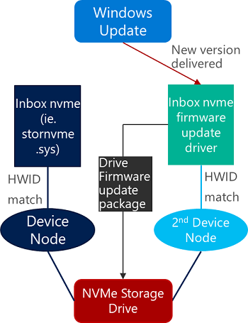
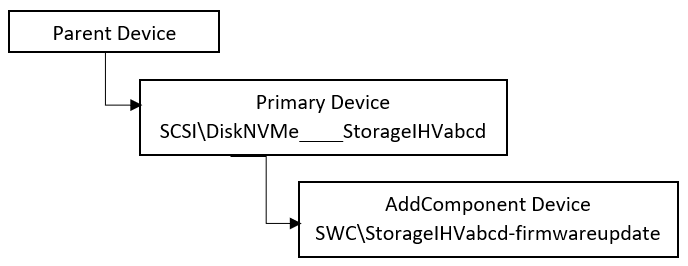

# Storage Firmware Update (SFU) driver

Updating firmware for NVMe storage drives has relied on hardware vendors to create firmware update applications which utilize specific [firmware update IOCTLs](https://docs.microsoft.com/windows/win32/fileio/working-with-nvme-devices#dont-update-firmware-through-the-pass-through-mechanism) introduced in Windows 10. These applications are typically distributed outside of the Windows Update (WU) pipeline. End users need to determine which storage disks are in their device, obtain the correct storage drive firmware utility from a manufacturer's website, and manually download and install the updates.

Additionally, devices running [Windows 10 in S-mode](https://www.microsoft.com/windows/s-mode), are in an enhanced security configuration which only allows users to run Microsoft-verified applications, therefore vendor utilities may fail to update drive firmware. This manual process results in low adoption of firmware updates, increases support costs and customer satisfaction issues for hardware manufacturers.

> [!NOTE]
> Windows 10 in S mode works exclusively with apps from the Microsoft Store within Windows and accessories that are compatible with Windows 10 in S mode. A one-way switch out of S mode is available. Learn more at [windows.com/SmodeFAQ](https://support.microsoft.com/help/4020089).

[Updating device firmware using Windows Update (WU)](https://docs.microsoft.com/windows-hardware/drivers/install/updating-device-firmware-using-windows-update) service using a driver-based solution is available to hardware vendors and requires them to either add firmware update logic and payload to an existing function driver or provide a separate firmware update driver and package. This results in duplicative work across hardware partners and increases the overall servicing costs of storage drives. For more information about universal drivers, see [Getting Started with Universal Windows drivers](
https://docs.microsoft.com/windows-hardware/drivers/develop/getting-started-with-universal-drivers).

Utilizing the Windows 10 (version 20H1 or higher) it is possible to update NVMe drive firmware using a Microsoft-supplied driver and a hardware vendor supplied firmware update package. This solution can be distributed via WU to targeted drive(s) and devices using [Computer Hardware IDs (CHIDs)](https://docs.microsoft.com/windows-hardware/drivers/install/specifying-hardware-ids-for-a-computer).

> [!WARNING]
> Firmware updates are a potentially risky maintenance operation and should only be distributed after thorough testing of the new firmware image. It is possible that new firmware on unsupported hardware could negatively affect reliability and stability, or even cause data loss.

## Drive compatibility

To use Windows 10 to update drive firmware, you must have supported drives. To ensure common device behavior, Windows 10 specifies optional Hardware Lab Kit (HLK) requirements for NVMe devices. These requirements outline which commands a NVMe storage drive must support to be firmware-updatable using the new Windows Update based solution.

Contact your solution vendor for information about whether your hardware supports Windows updating the drive firmware.

For additional details, see the Windows device COMPAT requirements for NVMe: [Device.Storage.ControllerDrive.NVMe - sections 5.7 and 5.8](https://partner.microsoft.com/dashboard/collaborate/packages/7840).

> [!NOTE]
> The above link requires a valid account on the [Microsoft Collaborate](https://developer.microsoft.com/dashboard/collaborate/) portal.

## Storage Firmware Update (SFU) solution details

In the following diagram, Windows 10 provides both the function driver (stornvme.sys) and firmware update driver (storfwupdate.dll). To utilize the Microsoft supplied driver to update NVMe drive firmware, two separate driver submissions are required.



### Package 1 - Create identity for drive firmware update

Typically, this package contains the following:

- Extension INF to create software device node to act as the independently targeted hardware for the firmware update package

- Driver catalog

Submit your extension INF package as a separate driver submission.

Many device types, however, do not allow a single physical device to enumerate more than one device node. In this case, use an extension INF that specifies the [AddComponent](https://docs.microsoft.com/windows-hardware/drivers/install/inf-addcomponent-directive) directive to create a device node that can be targeted by Windows Update and install the firmware update driver on it. The following snippet from an INF file shows how you can do this:

```INF
[Manufacturer]
%Contoso%=Standard,NTamd64
[Standard.NTamd64]
%DeviceName%=Device_Install, SCSI\DiskNVMe____StorageIHVabcd
[StorageIHVabcd.Components]
AddComponent= StorageIHVabcd_component,,StorageIHVabcd_ComponentInstall
[StorageIHVabcd_ComponentInstall]
ComponentIDs = StorageIHVabcd-firmware-update
```

In the INF sample above, `ComponentIDs = StorageIHVabcd-firmware-update` indicates that the child device will have a hardware ID of **SWC\StorageIHVabcd-firmware-update**. When installed, this INF creates the following device hierarchy:



A sample extension INF to create a new identity for drive firmware updates is provided below. Since the **SCSI\DiskNVMe____StorageIHVabcd** hardware may not be unique across hardware manufacturers, the extension INF must utilize [CHID](https://docs.microsoft.com/windows-hardware/drivers/install/specifying-hardware-ids-for-a-computer) targeting for distribution.

### Package 2 - Drive firmware update package

Typically, this package contains the following:

- Universal driver INF of class firmware

- Firmware update payload binary

- Driver catalog

Submit your firmware package as a separate driver submission.

The drive firmware update package INF targets the new node **SWC\StorageIHVabcd-firmwareupdate** and invokes the Windows 10 storage firmware update driver. For a software-enumerated component device to function, its parent must be started. In order to use StorFwUpdate drive, developers should use the Include/Needs INF directives in the [DDInstall section](https://docs.microsoft.com/windows-hardware/drivers/install/inf-ddinstall-section) for each possible `[DDInstall.*]` section to the corresponding `[StorFwUpdate.*]` sections as shown below, regardless of whether the INF specifies any directives for that section or not:

```INF
[StorFwUpdateOem.NT]
Include            = StorFwUpdate.inf
Needs              = StorFwUpdate.NT
CopyFiles          = StorFwUpdateOem.CopyFiles

[StorFwUpdateOem.NT.Wdf]
Include            = StorFwUpdate.inf
Needs              = StorFwUpdate.NT.Wdf

[StorFwUpdateOem.NT.Services]
Include            = StorFwUpdate.inf
Needs              = StorFwUpdate.NT.Services
```

For more information, see [Using a Component INF file](https://docs.microsoft.com/windows-hardware/drivers/install/using-a-component-inf-file). A sample NVMe drive firmware update INF file is provided below. Since the **SWC\StorageIHVabcd-firmwareupdate** software identity may not be unique across hardware manufacturers, the INF must utilize [CHID](https://docs.microsoft.com/windows-hardware/drivers/install/specifying-hardware-ids-for-a-computer) targeting for WU distribution.

The StorFwUpdate component does not perform any validation (signature verification or decryption) of the firmware binary payload. If this level of feature is required then hardware partners can write their own storage firmware update driver.

## Storage drive firmware update example

Since both INFs require CHIDs for WU distribution, hardware partners can validate the solution locally using PNPUTIL.EXE as shown below.

### Requirements

- Windows 10, version 20H1 (build 18985 or higher)

- Device with NVMe storage drive using inbox stornvme.sys driver

- NVMe drive firmware binary

- Properly authored INF files

### View current NVMe disk firmware version

To view the current NVMe disk firmware version:

1. Open a Powershell window as an administrator.

1. Type `Get-PhysicalDisk | Get-StorageFirmwareInformation` to view the current NVMe disk firmware version.

    

Note the current **ActiveSlotNumber** and **FirmwareVersionInSlot** values.

For more information, see [Get-StorageFirmwareInformation](https://docs.microsoft.com/powershell/module/storage/get-storagefirmwareinformation?view=win10-ps).

### Install the extension INF to create new software hardware identity

1. Move to the directory on your system that contains the driver extension package INF file. For example, type `cd .\signed-DiskExtnPackage\`.

1. Verify that the extension INF file contains the information for the drives you are updating. See [Disk extension INF file](#disk-extension-inf-sample) in this topic for an example extension INF.

1. Install the extension INF with the Microsoft PnP utility. For example, in an administrator command prompt, type `pnputil /add-driver .\OEMDiskExtnPackage.inf /install`. As the new software node is created as a child of a boot critical device, a reboot is required to take effect.

    

### View the new software component (SWC) node

To view the new SWC node and hardware ID:

1. From the Windows 10 Start menu, open **Control Panel**, then open **Device Manager**.

1. In Device Manager, select **Disk drives**, then expand the node and select the disk drive you have updated.

1. Once you have selected the drive you have updated, in the **Device Manager** **View** menu, select **Devices by connection**.

1. Click on the selected drive node, then click to expand. You will see a child **Generic software component** under the drive node.

1. Right-click on the **Generic software component** and click **Properties**.

1. In the **Properties** dialog window, select the **Details** tab, then select **Hardware Ids** from the **Property** drop down list view the Hardware ID for the **Generic software component** on the drive node.

1. The SWC\\* Hardware Id should match the one specified in the Extension INF.

### View and install the NVMe disk firmware update

1. Open a Powershell window as an administrator.

1. Move to the directory on your system that contains the NVMe disk firmware update INF file. For example, type `cd .\signed-ihv-firmware\`.

1. Verify that the disk firmware update INF contains the information for the drives you are updating. See the [Disk Firmware INF file](#disk-firmware-inf-sample) in this topic for an example disk firmware update INF.

1. Install the disk firmware update INF with the Microsoft PnP utility. For example, in an administrator command prompt, type `pnputil /add-driver .\StorFwUpdateIHV.inf /install`.

1. Open a Powershell window as an administrator.

1. Type `Get-PhysicalDisk | Get-StorageFirmwareInformation` to view the updated NVMe disk firmware information.

    

View the updated NVMe disk firmware information in the **ActiveSlotNumber** and **FirmwareVersionInSlot** values.

For more information, see [Get-StorageFirmwareInformation](https://docs.microsoft.com/powershell/module/storage/get-storagefirmwareinformation?view=win10-ps).

## Disk extension INF sample

The following is an example extension INF file:

```INF
;/*++
;
;Copyright (c) Microsoft Corporation.  All rights reserved.
;
;Module Name:
;    OEMDiskExtnPackage.inx
;
;Abstract:
;    INF file for installing the OEMDiskExtnPackage. This will create a SWC\ DevNode
;    which will service as the target HWID for the Disk storage firmware package.
;--*/

[Version]
Signature="$Windows NT$"
Class = Extension
ClassGuid = {e2f84ce7-8efa-411c-aa69-97454ca4cb57}
Provider=%ManufacturerName%
ExtensionId = {D91908BD-43FA-411B-92A1-C378AE5AF9FA}
CatalogFile=delta.cat
DriverVer = 08/26/2019,1.0.0.0

[SourceDisksNames]
1 = %DiskName%

[Manufacturer]
%ManufacturerName%=Standard,NTamd64

[Standard.NTamd64]
%OEMDiskExtnPackage.DeviceDesc%=StorageIHV1-87B, SCSI\DiskNVMe____StorageIHV1-87B
%OEMDiskExtnPackage.DeviceDesc%=StorageIHV1-87A, SCSI\DiskNVMe____StorageIHV1-87A
%OEMDiskExtnPackage.DeviceDesc%=StorageIHV2_KUS02020, SCSI\DiskNVMe____StorageIHV2_KUS02020
%OEMDiskExtnPackage.DeviceDesc%=StorageIHV3_KBG40ZPZ512G, SCSI\DiskNVMe____KBG40ZPZ512G_IHV300Y9
%OEMDiskExtnPackage.DeviceDesc%=StorageIHV3_KBG40ZPZ512G, SCSI\DiskNVMe____KBG40ZPZ512G_IHV30015

[StorageIHV1-87B.NT]
[StorageIHV1-87B.NT.Components]
AddComponent = StorageIHV1-87B_component,,StorageIHV1-87B_ComponentInstall

[StorageIHV1-87B_ComponentInstall]
ComponentIds=StorageIHV1-87B

[StorageIHV1-87A.NT]
[StorageIHV1-87A.NT.Components]
AddComponent = StorageIHV1-87A_component,,StorageIHV1-87A_ComponentInstall

[StorageIHV1-87A_ComponentInstall]
ComponentIds=StorageIHV1-87A

[StorageIHV2_KUS02020.NT]
[StorageIHV2_KUS02020.NT.Components]
AddComponent = StorageIHV2_KUS02020_component,,StorageIHV2_KUS02020_ComponentInstall

[StorageIHV2_KUS02020_ComponentInstall]
ComponentIds=StorageIHV2_KUS02020

[StorageIHV3_KBG40ZPZ512G.NT]
[StorageIHV3_KBG40ZPZ512G.NT.Components]
AddComponent = StorageIHV3_KBG40ZPZ512G_component,,StorageIHV3_KBG40ZPZ512G_ComponentInstall

[StorageIHV3_KBG40ZPZ512G_ComponentInstall]
ComponentIds=StorageIHV3_KBG40ZPZ512G

;*****************************************
; Strings section
;*****************************************

[Strings]
ManufacturerName = "OEM"
DiskName = "OEM Disk Extn package Installation Disk"
OEMDiskExtnPackage.DeviceDesc = "Disk Extn Package"
OEMDiskExtnPackage.SVCDESC = "Disk Extn Package"

;Non-Localizable
REG_EXPAND_SZ          = 0x00020000
REG_DWORD              = 0x00010001
REG_MULTI_SZ           = 0x00010000
REG_BINARY             = 0x00000001
REG_SZ                 = 0x00000000

SERVICE_KERNEL_DRIVER  = 0x1
SERVICE_ERROR_IGNORE   = 0x0
SERVICE_ERROR_NORMAL   = 0x1
SERVICE_ERROR_SEVERE   = 0x2
SERVICE_ERROR_CRITICAL = 0x3
```

## Disk firmware INF sample

The following is an example disk firmware INF file:

```INF
;;;;;;;;;;;;;;;;;;;;;;;;;;;;;;;;;;;;;;;;;;;;;;;;;;;;;;;;;;;;;;;;;;;;;;;;;;;;;;;
; File:               StorageIHV3-Firmware-Update.inx
;
; Description:        Driver installation file for firmware update.
;
; Copyright (C) Microsoft Corporation.  All Rights Reserved.
; Licensed under the MIT license.
;;;;;;;;;;;;;;;;;;;;;;;;;;;;;;;;;;;;;;;;;;;;;;;;;;;;;;;;;;;;;;;;;;;;;;;;;;;;;;;

[Version]
Signature="$Windows NT$"
Class=Firmware
ClassGuid={f2e7dd72-6468-4e36-b6f1-6488f42c1b52}
Provider=%ManufacturerName%
CatalogFile=delta.cat
DriverVer = 08/26/2019,11.37.9.948
PnPLockDown=1

[SourceDisksNames]
1= %DiskName%

[DestinationDirs]
StorFwUpdateOem.CopyFiles=13

[Manufacturer]
%ManufacturerName%=Standard,NTamd64

[Standard.NTamd64]
%StorFwUpdateOem.DeviceDesc%=StorFwUpdateOem, SWC\StorageIHV3_KBG40ZPZ512G

[StorFwUpdateOem.NT]
Include            = StorFwUpdate.inf
Needs              = StorFwUpdate.NT
CopyFiles          = StorFwUpdateOem.CopyFiles

[StorFwUpdateOem.NT.Wdf]
Include            = StorFwUpdate.inf
Needs              = StorFwUpdate.NT.Wdf

[StorFwUpdateOem.NT.HW]
AddReg = StorFwUpdateOem_HWAddReg

[StorFwUpdateOem_HWAddReg]
HKR,,FriendlyName,,%FwUpdateFriendlyName%

; Specify the location of the firmware offer and payload file in the registry.
; The files are kept in driver store. When deployed, %13% would be expanded to the actual path
; in driver store.
;
HKR,0D9EB3D6-6F14-4E8A-811B-F3B19F7ED98A\0,FirmwareImageVersion, 0x00000000, "AEMS0102"
HKR,0D9EB3D6-6F14-4E8A-811B-F3B19F7ED98A\0,FirmwareFileName, 0x00000000, %13%\AEMS0102.sig

[SourceDisksFiles]
AEMS0102.sig=1

[StorFwUpdateOem.CopyFiles]
AEMS0102.sig

[StorFwUpdateOem.NT.Services]
Include            = StorFwUpdate.inf
Needs              = StorFwUpdate.NT.Services

; =================== Generic ==================================

[Strings]
ManufacturerName="{Your Manufacturer Name}"
StorFwUpdateOem.DeviceDesc = "Storage Firmware Update (StorageIHV3) 1"
DiskName = "Storage Firmware Update Installation Disk"
FwUpdateFriendlyName= "StorageIHV3 Firmware Update"
```

## Deploy the extension INF and firmware packages through Windows Update

Next, deploy the package through Windows Update using appropriate CHIDs.

For information about deployment, see [Windows 10 Driver Publishing Workflow](https://download.microsoft.com/download/B/A/8/BA89DCE0-DB25-4425-9EFF-1037E0BA06F9/windows10_driver_publishing_workflow.docx)

## Additional resources

[Identifiers for SCSI Devices](https://docs.microsoft.com/windows-hardware/drivers/install/identifiers-for-scsi-devices)
