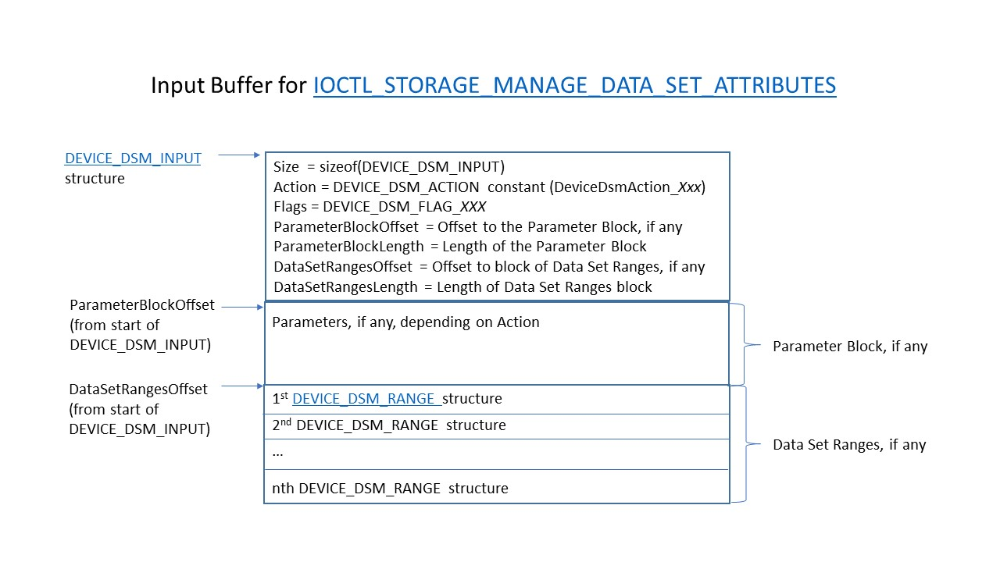

# Data Set Management Overview

Management actions can be performed on a device's data-set attributes as data set management (DSM) actions. DSM actions are defined by Microsoft. This functionality is available starting with Windows 7.

Specifically, a DEVICE_DSM_ACTION constant, defined in *ntddstor.h*, is used to specify the action to perform along with any action-specific flags. See [DEVICE_DSM_ACTION Descriptions](device-dsm-action-descriptions.md) for descriptions of all DEVICE_DSM_ACTION constants.

A DEVICE_DSM_ACTION constant is passed in the **Action** member of the [DEVICE_DSM_INPUT](https://docs.microsoft.com/windows-hardware/drivers/ddi/content/ntddstor/ns-ntddstor-_device_manage_data_set_attributes) structure contained in the system buffer of an [IOCTL_STORAGE_MANAGE_DATA_SET_ATTRIBUTES](https://docs.microsoft.com/windows-hardware/drivers/ddi/content/ntddstor/ni-ntddstor-ioctl_storage_manage_data_set_attributes) request. If the action requires additional parameters, a parameter block will immediately follow the DEVICE_DSM_INPUT structure. Data set ranges, if any, will immediately follow the parameter block. The system buffer structure is shown in the following diagram.

Currently, the only defined action-specific flag is **DeviceDsmActionFlag_NonDestructive**. If this flag is bitwise **OR**'d with a DEVICE_DSM_ACTION constant, the specified action is nondestructive (no data will be altered). When **DeviceDsmActionFlag_NonDestructive** is set, the driver can safely forward the [IOCTL_STORAGE_MANAGE_DATA_SET_ATTRIBUTES](https://docs.microsoft.com/windows-hardware/drivers/ddi/content/ntddstor/ni-ntddstor-ioctl_storage_manage_data_set_attributes) request to the next lower driver in the stack even if the driver does not handle the specified action.

> [!NOTE]
> Before it forwards the [IOCTL_STORAGE_MANAGE_DATA_SET_ATTRIBUTES](https://docs.microsoft.com/windows-hardware/drivers/ddi/content/ntddstor/ni-ntddstor-ioctl_storage_manage_data_set_attributes) request, the driver still performs the normal processing of the block of data set ranges that are specified in the [DEVICE_DSM_INPUT](https://docs.microsoft.com/windows-hardware/drivers/ddi/content/ntddstor/ns-ntddstor-_device_manage_data_set_attributes) structure. This block is located at **DataSetRangesOffset** and consists of one or more contiguous entries formatted as [DEVICE_DATA_SET_RANGE](https://docs.microsoft.com/windows-hardware/drivers/ddi/content/ntddstor/ns-ntddstor-_device_data_set_range) structures. The length, in bytes, of the data set ranges is set in the **DataSetRangesLength** member of DEVICE_DSM_INPUT.

The process flow of a DSM action is shown in the following diagram, where *Sender* is the action requestor and *Handler* processes the requested action (there can be more than one *Handler* in the stack):

1) *Sender* allocates a [DEVICE_DSM_INPUT](https://docs.microsoft.com/windows-hardware/drivers/ddi/content/ntddstor/ns-ntddstor-_device_manage_data_set_attributes) structure, initializes it with the [DEVICE_DSM_ACTION](device-dsm-action-definitions/) to be performed, and provides any additional action-specific information as needed in the parameter block and ranges block.
2) *Sender* sends an IOCTL_STORAGE_MANAGE_DATA_SET_ATTRIBUTES request, passing the initialized input data in the IOCTL's *InputBuffer*.
3) *Handler* validates the input by calling [**DeviceDsmValidateInput**](https://docs.microsoft.com/windows-hardware/drivers/ddi/content/ntddstor/nf-ntddstor-devicedsmvalidateinput).
4) If the input is valid, *Handler* unpacks the input and handles the DSM action.
5) If the action requires output, *Handler* creates output and returns it.
6) *Sender* validates the output by calling [**DeviceDsmValidateOutput**](https://docs.microsoft.com/windows-hardware/drivers/ddi/content/ntddstor/nf-ntddstor-devicedsmvalidateoutput).
7) If the output is valid, *Sender* unpacks the output.
