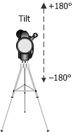

# KSPROPERTY_CAMERACONTROL_TILT

User-mode clients use the **KSPROPERTY_CAMERACONTROL_TILT** property to get or set a camera's tilt setting. This property is optional.

### Usage Summary Table

| Get | Set | Target | Property descriptor type | Property value type |
|--|--|--|--|--|
| Yes | Yes | Filter or node | [**KSPROPERTY_CAMERACONTROL_S**](/windows-hardware/drivers/ddi/ksmedia/ns-ksmedia-ksproperty_cameracontrol_s) or [**KSPROPERTY_CAMERACONTROL_NODE_S**](/windows-hardware/drivers/ddi/ksmedia/ns-ksmedia-ksproperty_cameracontrol_node_s) | LONG |

The property value (operation data) is a LONG that specifies a camera's tilt setting. This value is expressed in degrees.

Positive values point the imaging plane up. Negative values point the imaging plane down, as shown in the following illustration.

Every video capture minidriver that supports this property must define a range and default value for this property. The range for the device must -180 through +180. The default value must be 0.

> [!CAUTION]
> When writing or testing an app, you should be aware that in practice, some drivers define a custom range of tilt values and custom step values that might not be based on typical units. Drivers might implement the tilt control either physically or digitally.

## Remarks

The **Value** member of the KSPROPERTY_CAMERACONTROL_S structure specifies the tilt setting.

## Requirements

**Header:** ksmedia.h (include Ksmedia.h)

## See also

[**KSPROPERTY**](ksproperty-structure.md)

[**KSPROPERTY_CAMERACONTROL_S**](/windows-hardware/drivers/ddi/ksmedia/ns-ksmedia-ksproperty_cameracontrol_s)
